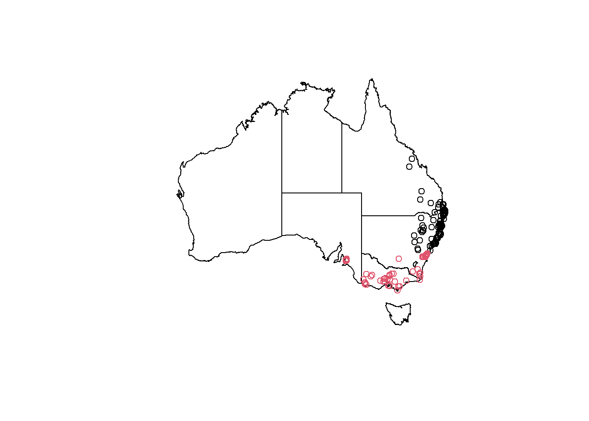

# Introducing the koala dataset


Before we get started, we will have a peek at the dataset we're working with. You can download the dataset for this tutorial [here](https://www.dropbox.com/s/1zhru8ui3btmg0n/koala.csv?dl=1). Put it in a `data` folder within your project (or working directory). You can now load it like:


```r
koala<-read.csv('data/koala.csv')
```

The koala dataset contains the positions of  koalas from throughout their range in Latitude and Longitude (`X` and `Y`) as well as variables describing their physiology, behavior and how they were recorded. The position of each koala was extracted from the [Atlas of Living Australia](https://www.ala.org.au/).  This is typical presence-only wildlife data, combining observations with some data describing each individual, which could e.g. be used for distribution modeling or to test influences of other variables such as climate on behavior and physiology of this particular species. 

## *data types* and *variable types*


Let's have a look at the data structure using `str()`


```r
str(koala)
```

```
## 'data.frame':	242 obs. of  15 variables:
##  $ species: Factor w/ 1 level "Phascolarctos cinereus": 1 1 1 1 1 1 1 1 1 1 ...
##  $ X      : num  153 148 153 153 153 ...
##  $ Y      : num  -27.5 -22.5 -27.5 -27.5 -27.5 ...
##  $ state  : Factor w/ 4 levels "New South Wales",..: 2 2 2 2 2 2 2 2 2 2 ...
##  $ region : Factor w/ 2 levels "northern","southern": 1 1 1 1 1 1 1 1 1 1 ...
##  $ sex    : Factor w/ 2 levels "female","male": 2 1 2 2 1 2 2 2 1 1 ...
##  $ weight : num  7.12 5.45 6.63 6.47 5.62 ...
##  $ size   : num  70.8 70.4 68.7 73 65.2 ...
##  $ fur    : num  1.86 1.85 2.48 1.92 1.95 ...
##  $ tail   : num  1.17 1.56 1.06 1.8 1.63 ...
##  $ age    : int  8 10 1 1 10 12 9 1 1 1 ...
##  $ color  : Factor w/ 6 levels "chocolate brown",..: 3 4 6 3 4 4 6 4 3 3 ...
##  $ joey   : Factor w/ 2 levels "No","Yes": 1 2 1 1 1 1 1 1 1 1 ...
##  $ behav  : Factor w/ 3 levels "Feeding","Just Chillin",..: 3 3 2 3 3 1 2 3 1 3 ...
##  $ obs    : Factor w/ 3 levels "Opportunistic",..: 2 1 2 3 3 1 3 2 2 2 ...
```
The first line tells us what we're dealing with: a `data.frame` object containing 242 observations and 15 variables. `data.frames`s are a standard data type object used in `R`. You can compare it to an excel sheet. The observations are your rows, so this `data.frame` is 242 rows long. Variables are your columns, of which we have 15. You can select a specific column using the `$` operator, to, e.g., print a column's variables into the console:


```r
koala$region
```

```
##   [1] northern northern northern northern northern northern northern northern
##   [9] northern northern northern northern northern northern northern northern
##  [17] southern southern southern southern southern southern southern southern
##  [25] southern southern southern southern southern southern southern southern
##  [33] southern southern southern southern southern southern southern southern
##  [41] southern southern southern southern southern southern southern southern
##  [49] southern southern southern southern southern southern southern southern
##  [57] southern southern southern southern southern northern northern northern
##  [65] northern southern northern northern northern southern northern northern
##  [73] southern northern northern southern northern northern northern northern
##  [81] northern northern northern northern northern northern northern northern
##  [89] northern northern southern northern northern northern northern southern
##  [97] northern northern northern northern southern northern northern northern
## [105] northern southern northern southern northern northern northern northern
## [113] northern southern northern northern northern northern northern southern
## [121] southern northern northern southern southern northern northern northern
## [129] northern southern northern northern northern northern northern northern
## [137] northern northern northern southern northern northern southern northern
## [145] southern southern southern northern northern northern northern southern
## [153] northern northern northern northern northern northern southern northern
## [161] northern northern northern northern northern northern northern northern
## [169] southern northern southern northern southern northern northern northern
## [177] northern southern northern northern northern northern northern northern
## [185] northern northern northern northern northern northern northern southern
## [193] northern northern northern southern southern northern northern northern
## [201] northern southern northern northern northern northern northern northern
## [209] northern northern northern northern northern northern northern northern
## [217] northern northern northern northern northern northern northern northern
## [225] northern northern northern northern northern northern northern southern
## [233] northern northern northern northern northern northern northern northern
## [241] northern southern
## Levels: northern southern
```

While that isn't very useful, it illustrates a basic function in R: how to define and address your data. It goes `data.frame$variable`, in this case `koala$region`, to access the `region` column of our data set. Using `summary()` on a variable gives us an overview of its distribution within the `data.frame`:


```r
summary(koala$region)
```

```
## northern southern 
##      165       77
```

This is more helpful than printing all the values into the console. The reason why `R` is giving back a count is the *variable type*, this variable has been assigned. As you can see from the above `str(koala)`, the `region` variable is a `Factor`. `Factors` are the *variable type* which are used to categorize  data and store it as so-called *levels*. They can store both *strings* (combinations of letters, usually words) and *integers* (real numbers without decimals). To have a better idea what this means, run:


```r
str(koala$region)
```

```
##  Factor w/ 2 levels "northern","southern": 1 1 1 1 1 1 1 1 1 1 ...
```

And you will see it returns you *variable type* `Factor` with two levels (northern and southern). This variables describes the the looks of koalas, as the southern animals are distinct in their morphology from their northern cousins, even though they're the same species. `class()` will give you only the *variable type* type:


```r
class(koala$region)
```

```
## [1] "factor"
```

Other `Factor` variables in the data are:

1. `state`: the Australian state in which the observation was made
2. `sex`: the gender of each individual koala
3. `color`: the fur color of the individual
4. `joey`: `Yes` if the observed koala had an offspring during the observation. You will see this (logically) only applied to koalas that had `sex == 'female'`
5. `behav`: what behavior was exhibited during the observation
6. `obs`: the type of observation made by the observer. Was it *opportunistic* and thus by chance, or maybe during a *spotlighting* survey?

You can explore what sort of factor levels each of these variables have as we did before using `summary()`


```r
summary(koala$behav)
```

```
##      Feeding Just Chillin     Sleeping 
##           48           67          127
```

Honoring their species as being one of the chillest marsupials on the planet, almost 1/3 of all koalas were `Just Chillin` ;).

From our `str(koala)` above we can make out two other data types:

1. `num` or numeric *variable type*
2. `int` or an integer *variable type*

Decimal values are called `num` or numeric in R. It is the default data type. If we assign a decimal value to a variable `x` it will always be of numeric type.


```r
x<-20.25
x
```

```
## [1] 20.25
```

```r
class(x)
```

```
## [1] "numeric"
```

Numeric data in our `koala` dataset are the `X` and `Y` columns, which describe the geographic location of each observation and then four variables describing their individual physiology:

1. `weight`: an individuals weight in kilo
2. `size`: an individuals height in centimeters
3. `fur`: its fur thickness in cm. Southern koalas have thicker fur because of the colder weather :)
4. `tail`: the tail length of each observed individual.

If you're wondering how these observations were made while only looking for koalas, you'll find the surprising answer at the end of this document.

The remaining variable type we have in our data is `int` or integer. These are non-decimal numbers. In our case the `age` is describer as an integer, a full number, describing the year of life each koala is in. It is hard to determine the exact age, so these variables will often be given as integer, rather than e.g. `age == 3.234`.

If you want to assign integers, you need to specify so, as we have learned the standard variable type for numbers in `R` is `num`.:


```r
y = as.integer(8) 
y     
```

```
## [1] 8
```

```r
class(y)  
```

```
## [1] "integer"
```

```r
#We can also declare an integer by appending an L suffix.

z = 8L
is.integer(z)
```

```
## [1] TRUE
```

The `is.xxx()` function can be useful to test for variable types in large datasets. It works with any data such as `is.integer`, `is.numeric` or `is.factor`.

## Changing *variable types*

We can shift data types around in `R` easily using `as.xxx()`. Let's make a new variable in our dataset that numerically codes the observation types. This might be important for some modelling approaches that force you to use `numeric` or `integer` data:


```r
koala$obs_code<-as.numeric(koala$obs) #this assigns a new column to the dataframe and fills it with the function we specify after the assign operator `<-`

head(koala)
```

```
##                  species        X         Y      state   region    sex   weight
## 1 Phascolarctos cinereus 153.2155 -27.49284 Queensland northern   male 7.119754
## 2 Phascolarctos cinereus 148.1443 -22.47617 Queensland northern female 5.451345
## 3 Phascolarctos cinereus 153.2285 -27.50298 Queensland northern   male 6.630577
## 4 Phascolarctos cinereus 152.6000 -27.50000 Queensland northern   male 6.470019
## 5 Phascolarctos cinereus 153.2817 -27.52589 Queensland northern female 5.620447
## 6 Phascolarctos cinereus 152.8330 -27.20000 Queensland northern   male 7.287674
##       size      fur     tail age      color joey        behav           obs
## 1 70.80159 1.858696 1.168241   8       grey   No     Sleeping  Spotlighting
## 2 70.38537 1.852801 1.562456  10 grey-brown  Yes     Sleeping Opportunistic
## 3 68.65867 2.479280 1.056640   1 light grey   No Just Chillin  Spotlighting
## 4 72.98919 1.923974 1.801244   1       grey   No     Sleeping  Stagwatching
## 5 65.19529 1.945341 1.625600  10 grey-brown   No     Sleeping  Stagwatching
## 6 70.56514 1.688897 1.086675  12 grey-brown   No      Feeding Opportunistic
##   obs_code
## 1        2
## 2        1
## 3        2
## 4        3
## 5        3
## 6        1
```

You can see e.g. *spotlighting* was assigned a `2`, while *Opportunistic* is now a `1`. Knowing these basic data transformations can be useful. This is especially often the case when assigning or merging data that is of type `character`, a *variable type*, we don't have in our data. Let's see what might be problematic about it:


```r
koala$good_bad<-sample(c('good', 'evil'), nrow(koala),  prob=c(0.99, 0.01), replace = T)
```

Using `sample` we can randomly assign a new variable, that is picked from a specified vector (`c('good', 'evil')`), based on a specified probability (`prob=c(0.99, 0.05)`). Let's get a summary of it to see how many of our koalas are bad by random probability of 5%:


```r
summary(koala$good_bad)
```

```
##    Length     Class      Mode 
##       242 character character
```

```r
class(koala$good_bad)
```

```
## [1] "character"
```

Hm, that isn't very helpful, because we created a `character` type data, made up of strings (letters). If we transform it, we can get a better idea:


```r
summary(as.factor(koala$good_bad))
```

```
## evil good 
##    5  237
```

5 of our koalas are evil :(

There are other *variable type*s you will encounter, such as `dates`, or `logicals` (`TRUE` and `FALSE`), but we won't go into more detail here. You're already all set to dive into data manipulation and visualization using this data set now :)

## How the koala dataset was collated

Some of you might be interested how all this data came together. As mentioned before, the observation locations are all from the [Atlas of Living Australia](https://www.ala.org.au/). You can download species records from their database as GIS shapefiles or `.csv` tables, containing the species name and `X` and `Y` coordinates as latitude and longitude. Now while most of the variables in the dataset may be collected during surveys, we did not have access to recent koala data or data from another animal throughout its Australian distribution, so we just made it up wit the power of `R` :) Here is how its done!

### Loading the raw data

You can find the raw data [here](https://www.dropbox.com/s/ffhmnei31ab5854/koala_raw.csv?dl=1). It simply contained four columns of `genus`, `species`, `X` and `Y`:


```r
koala_raw<-read.csv('data/koala_raw.csv')
```

Now the following steps are a bit more advanced and we will cover parts of it in our spatial data in `R` tutorial. This is simply to document how the dataset was collated and what can be done in R in a simple steps:

### Adding the state names by location

We need to use some `tidyverse` packages and the spatial package `sf` to load shapefiles:


```r
library(sf)
library(tidyverse)
```

We need to load a layer of Australia and transform our koala observations into a spatial data type (a shapefile). You can find the Australia layer [here](https://www.dropbox.com/s/7edsxu5eezrzrqu/Australia.rar?dl=1). Put it in `data/Australia`.


```r
#make shapefile from raw data

koala_base_sf <- st_as_sf(koala_raw, 
                     coords = c("Longitude", 
                                "Latitude"), 
                     crs = 4326)

#load states states layer

states <- st_read('data/Australia/Australia_proj.shp')
```

```
## Reading layer `Australia_proj' from data source `D:\OneDrive\OneDrive - The University of Melbourne\Github\forest-ecology-R-book\data\Australia\Australia_proj.shp' using driver `ESRI Shapefile'
## Simple feature collection with 8 features and 15 fields
## geometry type:  POLYGON
## dimension:      XY
## bbox:           xmin: -2063975 ymin: -4965263 xmax: 1891143 ymax: -1285856
## projected CRS:  GDA94 / Geoscience Australia Lambert
```

```r
#st_crs(states) #check CRS

#reproject to match koala data

states_proj<-st_transform(states, crs = st_crs(koala_base_sf))

#extract and reduce to interesting columns

koala_states<-st_intersection(koala_base_sf, states_proj)
```

```
## although coordinates are longitude/latitude, st_intersection assumes that they are planar
```

```r
koala_states_min<-koala_states%>%select(1,2,15)

#check  visually

plot(states_proj$geometry)

plot(koala_states_min$geometry, add = T, col = koala_states_min$STATENAME)
```


That works. This was the only other *real* data in our dataset. Let's make up some variables :)

### Creating dummy data

#### Sex and weight

First we want to add the weight of the animals. We want to make it realistic, so let's check some online sources by googling:

* https://environment.des.qld.gov.au/wildlife/animals/living-with/koalas/facts
* https://koalainfo.com/average-weights-of-male-koalas

Their sex ratio throughout their range seems to be 46:54 % in favor of females. Knowing the probability is great, so we can easily randomize that data over our observations:


```r
koala_states_min$sex<-sample(c('male', 'female'), nrow(koala_states_min),  prob=c(0.46, 0.54), replace = T)%>%as.factor()

summary(koala_states_min$sex)
```

```
## female   male 
##    124    118
```

The weight depends on the sex and where the animal lives. Using a nested `ifelse()` statement will help us, to make assigning weights conditional on their sex:


```r
koala_states_min$weight<-ifelse(koala_states_min$STATENAME == 'Queensland' &  koala_states_min$sex == 'female',
                                runif(nrow(koala_states_min), min = 5, max = 6), 
                                ifelse(koala_states_min$STATENAME == 'Queensland' &  koala_states_min$sex == 'male',
                                       runif(nrow(koala_states_min), min = 6, max = 8), 
                                       ifelse(koala_states_min$STATENAME == 'Victoria' | 
                                                koala_states_min$STATENAME == 'South Australia' &  
                                                koala_states_min$sex == 'female',
                                              runif(nrow(koala_states_min), min = 7, max = 8),
                                              ifelse(koala_states_min$STATENAME == 'Victoria' | 
                                                       koala_states_min$STATENAME == 'South Australia' &  
                                                       koala_states_min$sex == 'male',
                                                     runif(nrow(koala_states_min), min = 15, max = 18), 
                                                     ifelse(koala_states_min$STATENAME == 'New South Wales' &  
                                                              koala_states_min$sex == 'female',
                                                            runif(nrow(koala_states_min), min = 6, max = 7), 
                                                            ifelse(koala_states_min$STATENAME == 'New South Wales' &  
                                                                     koala_states_min$sex == 'male',
                                                                   runif(nrow(koala_states_min), min = 8, max = 10),100))))))
```

#### Adding the `X` and `Y` variables and `region`

Using `sf` objects it is easy to add the coordinates using `st_coordinates`, but if we want to split them into two columns, we need to use a function:


```r
st_x = function(x) st_coordinates(x)[,1]
st_y = function(x) st_coordinates(x)[,2]

#st_x(koala_states_min)
#st_y(koala_states_min)

koala_states_min$X<-st_x(koala_states_min)
koala_states_min$Y<-st_y(koala_states_min)
```

Now we can add *northern* or *southern* by a condition based on latitude:


```r
koala_states_min$region<-ifelse(koala_states_min$Y>(-34),'northern', 'southern')%>%as.factor()

plot(states_proj$geometry)

plot(koala_states_min$geometry, add = T, col = koala_states_min$region)
```



#### Add other physiological variables

Some googling allows us to add the other variables based on semi-realistic data:

* https://www.savethekoala.com/about-koalas/physical-characteristics-koala

Sizes range from ~64 to over 80 cm, depending on sex and region:


```r
koala_states_min$size<-ifelse(koala_states_min$region == 'southern' & koala_states_min$sex == 'female',
                              runif(nrow(koala_states_min), min = 68, max = 73),
                              ifelse(koala_states_min$region == 'southern' & koala_states_min$sex == 'male',
                                     runif(nrow(koala_states_min), min = 75, max = 82),
                                     ifelse(koala_states_min$region == 'northern' & koala_states_min$sex == 'female',
                                            runif(nrow(koala_states_min), min = 64.8, max = 72.3),
                                            ifelse(koala_states_min$region == 'northern' & koala_states_min$sex == 'male',
                                                   runif(nrow(koala_states_min), min = 67.4, max = 73.6),100))))
```

* https://en.wikipedia.org/wiki/Koala

The fur color varies based on their region too with some different probabilities:


```r
koala_states_min$color<-ifelse(koala_states_min$region == 'northern', 
                               sample(c('light grey', 'grey', 'grey-brown'), nrow(koala_states_min),  
                                      prob=c(0.3, 0.4, 0.3), replace = T),
                               sample(c('dark grey', 'light brown', 'chocolate brown'), nrow(koala_states_min), 
                                      prob=c(0.4, 0.3, 0.3), replace = T))
```

* https://www.theanimalfiles.com/mammals/marsupials/koala.html

The tail length is constant between 1 - 2 cm, so we can randomize it throughout:


```r
koala_states_min$tail<-runif(nrow(koala_states_min), min = 1, max = 2)
```

Fur thickness varies by state and sex:


```r
koala_states_min$fur<-ifelse(koala_states_min$STATENAME == 'Queensland' &  koala_states_min$sex == 'female',
                                runif(nrow(koala_states_min), min = 1, max = 2), 
                                ifelse(koala_states_min$STATENAME == 'Queensland' &  koala_states_min$sex == 'male',
                                       runif(nrow(koala_states_min), min = 1.5, max = 2.5), 
                                       ifelse(koala_states_min$STATENAME == 'Victoria' | 
                                                koala_states_min$STATENAME == 'South Australia' &  
                                                koala_states_min$sex == 'female',
                                              runif(nrow(koala_states_min), min = 3, max = 5),
                                              ifelse(koala_states_min$STATENAME == 'Victoria' | 
                                                       koala_states_min$STATENAME == 'South Australia' &  
                                                       koala_states_min$sex == 'male',
                                                     runif(nrow(koala_states_min), min = 3.5, max = 6), 
                                                     ifelse(koala_states_min$STATENAME == 'New South Wales' &  
                                                              koala_states_min$sex == 'female',
                                                            runif(nrow(koala_states_min), min = 2, max = 3), 
                                                            ifelse(koala_states_min$STATENAME == 'New South Wales' &  
                                                                     koala_states_min$sex == 'male',
                                                                   runif(nrow(koala_states_min), min = 2.5, max = 3.5),
                                                                   100))))))
```


* https://environment.des.qld.gov.au/wildlife/animals/living-with/koalas/facts

They can become up to 12 years old, let's just randomize this throughout the range as well. The mean in that case should be around 6 years, as `sample()` assumes normally distributed data, if you do not specify the `prob`. We're using `replace = TRUE`, to make sure ages `1:12` can be repeated and are distributed over our 242 rows.


```r
koala_states_min$age<-sample(12, nrow(koala_states_min), replace = T)

mean(koala_states_min$age)
```

```
## [1] 6.235537
```

```r
hist(koala_states_min$age)
```


#### Adding some more factor variables

Finally we can add some more factorial variables which we make up completely (with some insider knowledge ;) ). Of course only females can have a joey:


```r
#offspring

koala_states_min$joey<-ifelse(koala_states_min$sex == 'female',
                              sample(c('Yes', 'No'), nrow(koala_states_min),  prob=c(0.38, 0.62), replace = T), 'No')

#behavior

koala_states_min$behav<-sample(c('Sleeping', 'Feeding', 'Just Chillin'), nrow(koala_states_min), 
                               prob=c(0.5, 0.2, 0.3), replace = T)

#survey tech

koala_states_min$obs<-sample(c('Spotlighting', 'Stagwatching', 'Opportunistic'), nrow(koala_states_min), 
                               prob=c(0.4, 0.3, 0.3), replace = T)
```

And that's all. Of course we can make up more variables, but for our purposes of practicing data manipulation, visualization, modeling and spatial data processing, this should be sufficient.

#### Polishing the data and saving

Now we can remove the geometry from our `sf`, to make it a simple `data.frame`:


```r
koala_final<-st_drop_geometry(koala_states_min)%>%select(species = Species, X, Y, state = STATENAME, region, sex, weight, size, fur, tail, age, color, joey, behav, obs )
```

After that we brought the data in order using `dplyr`'s `select()` and while doing so, we can also rename some columns. Next we save the data to our `outputs/` folder:


```r
write.csv(koala_final, 'outputs/koala_final.csv', row.names = F)
```

All set for our tutorials! Let's dive into some data manipulation in `dplyr` first! Have fun :)
