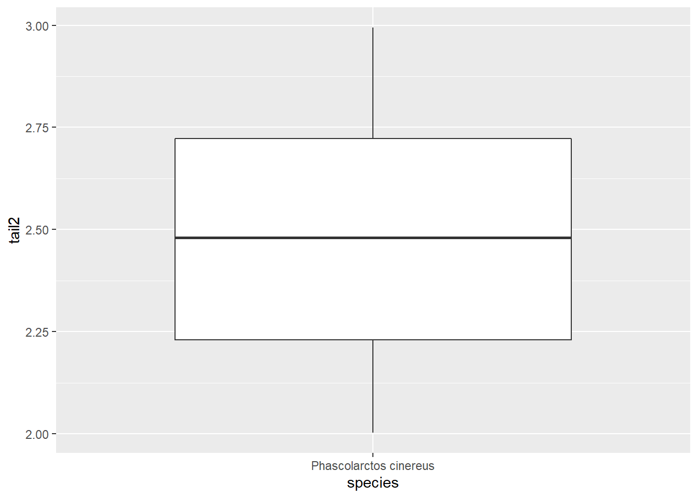
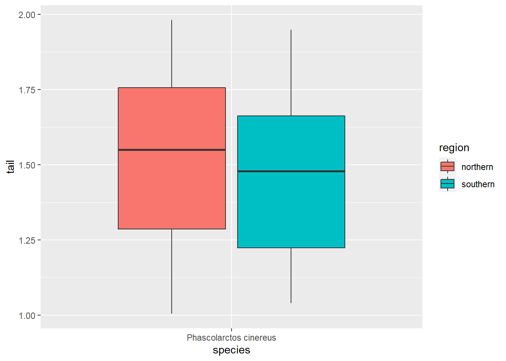
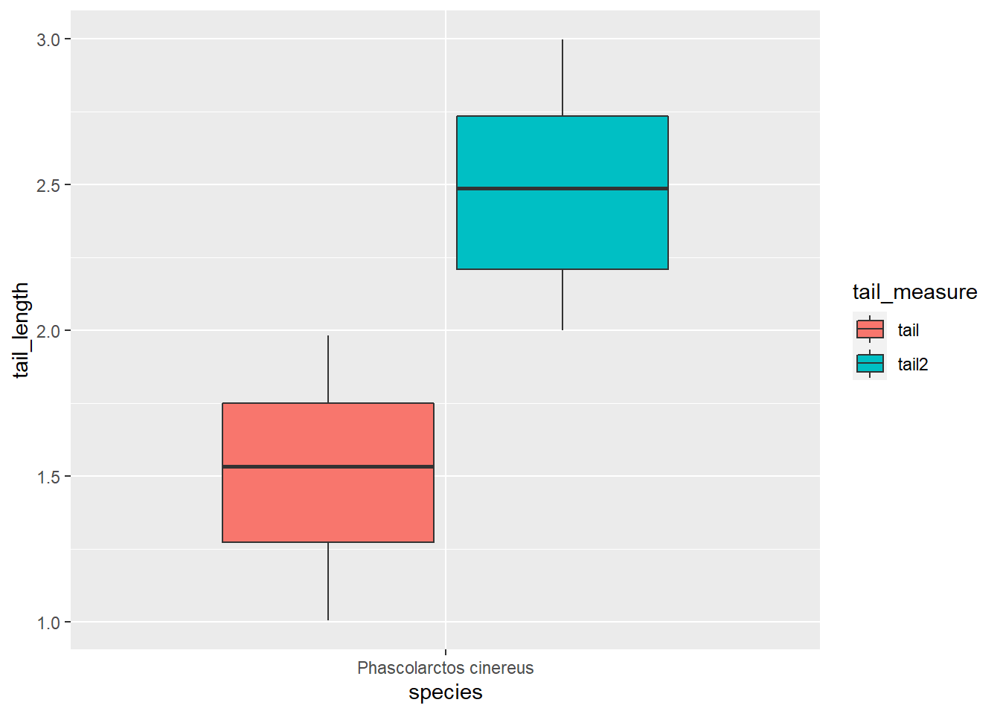
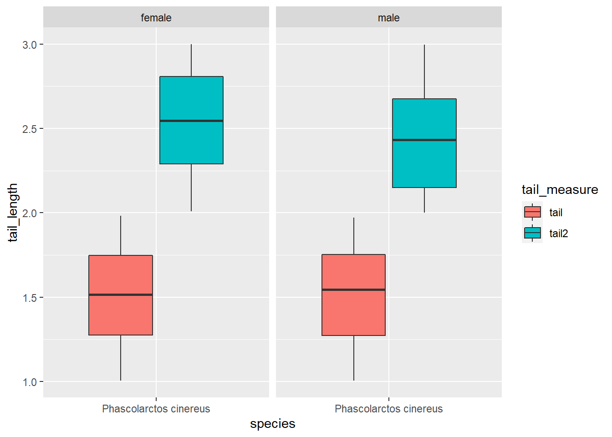

# `dplyr` - A brief introduction to tidy data manipulation


## Loading and checking the data

We will work with our koala dataset. You can download it [here](https://www.dropbox.com/s/1zhru8ui3btmg0n/koala.csv?dl=1). Furthermore you need to install the `tidyverse` package, which contains `dplyr`. 


```r
install.packages('tidyverse')
```

First we need to load the dataset we're working with.


```r
koala<-read.csv('data/koala.csv')
```

It should contain the following columns:


```r
names(koala)
```

```
##  [1] "species" "X"       "Y"       "state"   "region"  "sex"     "weight" 
##  [8] "size"    "fur"     "tail"    "age"     "color"   "joey"    "behav"  
## [15] "obs"
```

Lets look at a structure and summary of this dataset:


```r
str(koala)
```

```
## 'data.frame':	242 obs. of  15 variables:
##  $ species: Factor w/ 1 level "Phascolarctos cinereus": 1 1 1 1 1 1 1 1 1 1 ...
##  $ X      : num  153 148 153 153 153 ...
##  $ Y      : num  -27.5 -22.5 -27.5 -27.5 -27.5 ...
##  $ state  : Factor w/ 4 levels "New South Wales",..: 2 2 2 2 2 2 2 2 2 2 ...
##  $ region : Factor w/ 2 levels "northern","southern": 1 1 1 1 1 1 1 1 1 1 ...
##  $ sex    : Factor w/ 2 levels "female","male": 2 1 2 2 1 2 2 2 1 1 ...
##  $ weight : num  7.12 5.45 6.63 6.47 5.62 ...
##  $ size   : num  70.8 70.4 68.7 73 65.2 ...
##  $ fur    : num  1.86 1.85 2.48 1.92 1.95 ...
##  $ tail   : num  1.17 1.56 1.06 1.8 1.63 ...
##  $ age    : int  8 10 1 1 10 12 9 1 1 1 ...
##  $ color  : Factor w/ 6 levels "chocolate brown",..: 3 4 6 3 4 4 6 4 3 3 ...
##  $ joey   : Factor w/ 2 levels "No","Yes": 1 2 1 1 1 1 1 1 1 1 ...
##  $ behav  : Factor w/ 3 levels "Feeding","Just Chillin",..: 3 3 2 3 3 1 2 3 1 3 ...
##  $ obs    : Factor w/ 3 levels "Opportunistic",..: 2 1 2 3 3 1 3 2 2 2 ...
```

```r
summary(koala)
```

```
##                    species          X               Y         
##  Phascolarctos cinereus:242   Min.   :138.6   Min.   :-39.00  
##                               1st Qu.:150.0   1st Qu.:-34.49  
##                               Median :152.0   Median :-32.67  
##                               Mean   :150.3   Mean   :-32.36  
##                               3rd Qu.:152.9   3rd Qu.:-30.31  
##                               Max.   :153.6   Max.   :-21.39  
##              state          region        sex          weight      
##  New South Wales:181   northern:165   female:127   Min.   : 5.406  
##  Queensland     : 16   southern: 77   male  :115   1st Qu.: 6.574  
##  South Australia: 14                               Median : 7.277  
##  Victoria       : 31                               Mean   : 7.923  
##                                                    3rd Qu.: 8.765  
##                                                    Max.   :17.889  
##       size            fur             tail            age       
##  Min.   :64.81   Min.   :1.110   Min.   :1.004   Min.   : 1.00  
##  1st Qu.:68.43   1st Qu.:2.410   1st Qu.:1.272   1st Qu.: 3.00  
##  Median :70.27   Median :2.797   Median :1.534   Median : 7.00  
##  Mean   :70.94   Mean   :2.896   Mean   :1.507   Mean   : 6.43  
##  3rd Qu.:72.33   3rd Qu.:3.217   3rd Qu.:1.750   3rd Qu.: 9.00  
##  Max.   :81.91   Max.   :5.876   Max.   :1.981   Max.   :12.00  
##              color     joey              behav                obs    
##  chocolate brown:21   No :185   Feeding     : 48   Opportunistic:65  
##  dark grey      :36   Yes: 57   Just Chillin: 67   Spotlighting :94  
##  grey           :69             Sleeping    :127   Stagwatching :83  
##  grey-brown     :53                                                  
##  light brown    :20                                                  
##  light grey     :43
```

This dataset contains the positions of each koala in Latitude and Longitude (`X` and `Y`) as well as variables describing their physiology, behavior and how they were recorded. It's typical presence-only wildlife data, combining observations with some data describing each individual, which could e.g. be used for distribution modeling or to test influences of other variables such as climate on behavior and physiology of this particular species. You can read more about the dataset and typical `R` data types in the separate koala dataset tutorial, which will introduce you to the data and explain `R` data and variable types.

Often in these types of studies, we are not interested in all the recorded variables and thus first need to 'clean' our data to make it easier to work with it. `dplyr` is a package designed to make data 'cleaning' and manipulation of large datasets easier by introducing specific syntax. Let's see how it works and compares to base `R` functionality!

## Working with `dplyr`

Base `R` sub-setting can be very tedious. Imagine we want to got the mean age for our koalas, but split it by sex. Getting one mean is easy:


```r
mean(koala[koala$sex == 'male', "age"],na.rm = TRUE)
```

```
## [1] 6.626087
```

Summarizing both sexes and saving it in a table takes a few lines of code:


```r
female_mean<-mean(koala[koala$sex == 'female', "age"],na.rm = TRUE)

male_mean<-mean(koala[koala$sex == 'male', "age"],na.rm = TRUE)

means<-rbind(c(female_mean, male_mean))

means<-as.data.frame(means)

names(means)<-c('female', 'male')
```

Lets have a look at the results.


```r
means
```

```
##     female     male
## 1 6.251969 6.626087
```

That's all good, but with that many lines of code quite error prone ... `dplyr` makes data manipulation simpler. For this example, we would only require one line of code!


```r
library(dplyr)

mean_age_koala<-koala%>%group_by(sex)%>%summarise(mean_age = mean(age))
```

```
## `summarise()` ungrouping output (override with `.groups` argument)
```


```
## # A tibble: 2 x 2
##   sex    mean_age
##   <fct>     <dbl>
## 1 female     6.25
## 2 male       6.63
```

So simple, and looks even better than our base `R` table too! The main functions we will explore here are `dplyr`'s pipe `%>%`, `select()`, `filter()`, `group_by()`, `summarise()` and `mutate()`.

### select() and dplyr's pipe

If, for example, we wanted to move forward with only a few of the variables in our dataframe we could use the `select()` function. This will keep only the variables you select.


```r
koala_select<-select(koala, species, sex, age)
```


```
##                  species    sex age
## 1 Phascolarctos cinereus   male   8
## 2 Phascolarctos cinereus female  10
## 3 Phascolarctos cinereus   male   1
## 4 Phascolarctos cinereus   male   1
## 5 Phascolarctos cinereus female  10
## 6 Phascolarctos cinereus   male  12
```

If we open up `koala_select` we'll see that it only contains the species, sex and age columns. Above we used 'normal' `R` grammar, but the strengths of dplyr lie in combining several functions using pipes. Since the pipes grammar is unlike anything we've seen in R before, let's repeat what we've done above using pipes.


```r
koala_select_pipe<-koala%>%select(species, sex, age)
```

To help you understand why we wrote that in that way, let's walk through it step by step. First we summon the koala dataframe and pass it on, using the pipe syntax `%>%`, to the next step, which is the `select()` function. In this case we don't specify which data object we use in the `select()` function since in gets that from the previous pipe.

### filter()

`filter()` is one of the most useful dplyr functions for data manipulation. Say you're conducting a study of only male koalas. You won't need any data on female koalas. So lets get rid of it!


```r
koala_filter<-koala%>%filter(sex == 'male')
```

Did it work?


```r
summary(koala_filter$sex)
```

```
## female   male 
##      0    115
```

No more females in the data! Let's test our knowledge with a challenge.

### Challenge 1

**Write a single command (which can span multiple lines and includes pipes) that will produce a dataframe that has the values for age, size and color for females only. How many rows and columns does your dataframe have and why?**

*Extra challenge: out of this new dataset, filter only koalas >70cm in size. How many are there?*


This should be your data structure:


```r
nrow(challenge1)
```

```
## [1] 127
```

```r
ncol(challenge1)
```

```
## [1] 3
```

We removed all the males, so our row number reduces from 242 to 127. Then we filter our desired columns and are now at 3 instead of 15.


```r
nrow(challenge1.2)
```

```
## [1] 46
```

You can find the solutions to all challenges posed here at the end of the document. Don't peek!

### group_by() and summarise()

Now, we were supposed to be reducing the error prone repetitiveness of what can be done with base R, but up to now  we haven't done that since we would have to repeat the above for each sex. Instead of `filter()`, which will only pass observations that meet your criteria (in the above: `sex=="female"`), we can use `group_by()`, which will essentially use every unique criteria that you could have used in `filter()`. Let's see what happens with our data structure when using dplyr's `group_by()`.


```r
koala_group<-koala%>%group_by(sex)

str(koala_group)
```

```
## tibble [242 x 15] (S3: grouped_df/tbl_df/tbl/data.frame)
##  $ species: Factor w/ 1 level "Phascolarctos cinereus": 1 1 1 1 1 1 1 1 1 1 ...
##  $ X      : num [1:242] 153 148 153 153 153 ...
##  $ Y      : num [1:242] -27.5 -22.5 -27.5 -27.5 -27.5 ...
##  $ state  : Factor w/ 4 levels "New South Wales",..: 2 2 2 2 2 2 2 2 2 2 ...
##  $ region : Factor w/ 2 levels "northern","southern": 1 1 1 1 1 1 1 1 1 1 ...
##  $ sex    : Factor w/ 2 levels "female","male": 2 1 2 2 1 2 2 2 1 1 ...
##  $ weight : num [1:242] 7.12 5.45 6.63 6.47 5.62 ...
##  $ size   : num [1:242] 70.8 70.4 68.7 73 65.2 ...
##  $ fur    : num [1:242] 1.86 1.85 2.48 1.92 1.95 ...
##  $ tail   : num [1:242] 1.17 1.56 1.06 1.8 1.63 ...
##  $ age    : int [1:242] 8 10 1 1 10 12 9 1 1 1 ...
##  $ color  : Factor w/ 6 levels "chocolate brown",..: 3 4 6 3 4 4 6 4 3 3 ...
##  $ joey   : Factor w/ 2 levels "No","Yes": 1 2 1 1 1 1 1 1 1 1 ...
##  $ behav  : Factor w/ 3 levels "Feeding","Just Chillin",..: 3 3 2 3 3 1 2 3 1 3 ...
##  $ obs    : Factor w/ 3 levels "Opportunistic",..: 2 1 2 3 3 1 3 2 2 2 ...
##  - attr(*, "groups")= tibble [2 x 2] (S3: tbl_df/tbl/data.frame)
##   ..$ sex  : Factor w/ 2 levels "female","male": 1 2
##   ..$ .rows: list<int> [1:2] 
##   .. ..$ : int [1:127] 2 5 9 10 12 13 15 17 20 22 ...
##   .. ..$ : int [1:115] 1 3 4 6 7 8 11 14 16 18 ...
##   .. ..@ ptype: int(0) 
##   ..- attr(*, ".drop")= logi TRUE
```


You will notice that the structure of the dataframe where we used `group_by()` (`koala_group`) is not the same as the original `koala` dataset. A grouped dataset can be thought of as a list where each item in the list is a data.frame which contains only the rows that correspond to the a particular value 'Sex' (at least in the example above).

The above was a bit on the uneventful side because `group_by()` is only really useful in conjunction with `summarise()`. This will allow you to create new variable(s) by using functions that repeat for each of the  sex-specific data frames. That is to say, using the `group_by()` function, we split our original dataframe into multiple pieces, then we can run functions such as `mean()` or `sd()` within `summarise()`:


```r
koala_group_sum<-koala%>%group_by(sex)%>%
  summarise(mean_age=mean(age))
```

```
## `summarise()` ungrouping output (override with `.groups` argument)
```


```
## # A tibble: 2 x 2
##   sex    mean_age
##   <fct>     <dbl>
## 1 female     6.25
## 2 male       6.63
```

And there we go. We got what we wanted and summarised the mean age of our koalas for both sexes separately. And we did that using only one simple line of code! I think it is time for another challenge to test our skills!

### Challenge 2

**Calculate the average weight value per state and Sex. Which combination of state and sex has the heaviest and which combination had the lightest koalas?**


```
## # A tibble: 8 x 3
## # Groups:   state [4]
##   state           sex    mean_weight
##   <fct>           <fct>        <dbl>
## 1 New South Wales female        6.54
## 2 New South Wales male          9.07
## 3 Queensland      female        5.68
## 4 Queensland      male          6.82
## 5 South Australia female        7.59
## 6 South Australia male         16.8 
## 7 Victoria        female        7.58
## 8 Victoria        male          7.48
```

That is already quite powerful, but it gets even better! You're not limited to defining only one new variable in `summarise()`:


```r
challenge2_ext<-koala%>%group_by(state, sex)%>%
  summarise(mean_weight = mean(weight),
            sd_weight = sd(weight),
            sample_no = n())
```

```
## `summarise()` regrouping output by 'state' (override with `.groups` argument)
```

We can create a new dataframe with as many new variables as we want. Very useful for our initial data exploration! Let's get our hands another very useful function: `mutate()`.

### mutate()

We can  create an entirely new variables in our initial dataset prior to (or even after) summarizing information using `mutate()`. Let's say we're interested in the weight:size ratio of our Koalas. Also we want to give each individual a numeric identifier to be able to better work with our data later on.


```r
koala_mutate<-koala%>%mutate(weight_size_ratio = size/weight, ID = row_number())
```


```
##  [1] "species"           "X"                 "Y"                
##  [4] "state"             "region"            "sex"              
##  [7] "weight"            "size"              "fur"              
## [10] "tail"              "age"               "color"            
## [13] "joey"              "behav"             "obs"              
## [16] "weight_size_ratio" "ID"
```

Our dataset now has two extra columns containing the variables we were interested in. If you do not want to manipulate your raw data, you can use mutate before grouping and summarising to create the summary table straight away:


```r
koala_mutate_weight_size<-koala%>%mutate(weight_size_ratio = size/weight)%>%
  group_by(sex)%>%
  summarise(mean_weight = mean(weight),
            sd_weight = sd(weight),
            mean_weight_size = mean (weight_size_ratio),
            max_weight_size = max(weight_size_ratio))
```

```
## `summarise()` ungrouping output (override with `.groups` argument)
```


```
## # A tibble: 2 x 5
##   sex    mean_weight sd_weight mean_weight_size max_weight_size
##   <fct>        <dbl>     <dbl>            <dbl>           <dbl>
## 1 female        6.67     0.533            10.4             12.9
## 2 male          9.31     2.38              8.21            11.9
```

Great! Let's end the lesson with another challenge, combining all the functions we have looked at today.

### Challenge 3

**Calculate the average tail length and fur thickness for a group of 20 randomly selected males and females from New South Wales. Then arrange the mean tail length in descending order.**

*Hint: Use the dplyr functions* `arrange()` *and* `sample_n()`*, they have similar  syntax to other dplyr functions. Look at the help by calling '?function', e.g.* `?arrange`*.* 


```
## # A tibble: 2 x 3
##   sex    mean_tail mean_fur
##   <fct>      <dbl>    <dbl>
## 1 male        1.61     3.00
## 2 female      1.55     2.38
```

Since we are sampling randomly, these will look different for each of you.

### Pivoting

Another really useful processing option when manipulating or re-arranging data is pivoting, especially when you come from an Microsoft Excel background. For this, a bit of knowledge on *tidy* data is required. When we process data in `R`, it is extremely beneficial to have a long dataset, which we call *tidy*. These type of data follow three principles:

1. Variables make up our columns
2. Observations are in the rows 
3. Values are in the cells

Our koala dataset is an example of *tidy* data. Let's reduce our dataset to make an example:


```r
koala_subsample<-koala%>%select(species, region, sex, tail, age)

head(koala_subsample)
```

```
##                  species   region    sex     tail age
## 1 Phascolarctos cinereus northern   male 1.168241   8
## 2 Phascolarctos cinereus northern female 1.562456  10
## 3 Phascolarctos cinereus northern   male 1.056640   1
## 4 Phascolarctos cinereus northern   male 1.801244   1
## 5 Phascolarctos cinereus northern female 1.625600  10
## 6 Phascolarctos cinereus northern   male 1.086675  12
```

*Tidy* datasets, are also called *indexed* dataset. We can look up a measure using both region and sex as an index (like when we were grouping before). Let's assume we collect another measure of tail-length on another visit to our sites. In data-entry manner, this would probably go into another column:


```r
koala_subsample<-koala_subsample%>%mutate(tail2 = runif(nrow(koala_subsample), min = 2, max = 3))

head(koala_subsample)
```

```
##                  species   region    sex     tail age    tail2
## 1 Phascolarctos cinereus northern   male 1.168241   8 2.776718
## 2 Phascolarctos cinereus northern female 1.562456  10 2.465968
## 3 Phascolarctos cinereus northern   male 1.056640   1 2.735358
## 4 Phascolarctos cinereus northern   male 1.801244   1 2.138001
## 5 Phascolarctos cinereus northern female 1.625600  10 2.029862
## 6 Phascolarctos cinereus northern   male 1.086675  12 2.080291
```

Our table is now wide, because we added a variable, that is not indexed. This can cause problems, especially when we want to visualize these two measurements. We will introduce `ggplot2` for visualizing in later tutorials, but here is just a basic boxplot


```r
ggplot(koala_subsample, aes(x=species, y=tail)) + 
  geom_boxplot()
```


```r
ggplot(koala_subsample, aes(x=species, y=tail2)) + 
  geom_boxplot()
```



We can plot either column, but not both. Nevertheless, we can use another column that is already in long format, to separate the boxes:


```r
ggplot(koala_subsample, aes(x=species, y=tail, fill = region)) + 
  geom_boxplot()
```



Southern koalas have shorter tails, interesting :) If we want to compare our two measurements though, we need them in one column, and that is where pivoting comes in handy:


```r
koala_pivot<-koala_subsample%>%pivot_longer(cols = c(tail, tail2), names_to = 'tail_measure', values_to = 'tail_length')

head(koala_pivot)
```

```
## # A tibble: 6 x 6
##   species                region   sex      age tail_measure tail_length
##   <fct>                  <fct>    <fct>  <int> <chr>              <dbl>
## 1 Phascolarctos cinereus northern male       8 tail                1.17
## 2 Phascolarctos cinereus northern male       8 tail2               2.78
## 3 Phascolarctos cinereus northern female    10 tail                1.56
## 4 Phascolarctos cinereus northern female    10 tail2               2.47
## 5 Phascolarctos cinereus northern male       1 tail                1.06
## 6 Phascolarctos cinereus northern male       1 tail2               2.74
```

We create the index column `tail_measure` to address our two measurements. The column containing the measurements is now called `tail_length`. Let's see what has changed between the first and second measurement:


```r
ggplot(koala_pivot, aes(x=species, y=tail_length, fill = tail_measure)) + 
  geom_boxplot()
```



Wow, seems the tails have grown a lot in the past ;) We can also facet to check both the different measures and the genders:


```r
ggplot(koala_pivot, aes(x=species, y=tail_length, fill = tail_measure)) + 
  geom_boxplot()+
  facet_grid(~sex)
```



Great, now we know how to make our dataset long and thus *tidy*!

Let's create a dataset for you to practice:


```r
koala_subsample2<-koala%>%select(species, region, sex, age, tail, joey,)%>%
  mutate(age2 = age+sample(3, nrow(koala_subsample), replace = T),
         tail2 = runif(nrow(koala_subsample), min = 2, max = 3),
         tail3 = runif(nrow(koala_subsample), min = 1, max = 1.5),
         joey2 = ifelse(koala$sex == 'female',
                              sample(c('Yes', 'No'), nrow(koala),  prob=c(0.3, 0.7), replace = T), 'No'),
         joey3 = ifelse(koala$sex == 'female',
                              sample(c('Yes', 'No'), nrow(koala),  prob=c(0.5, 0.5), replace = T), 'No'),)

head(koala_subsample2)
```

```
##                  species   region    sex age     tail joey age2    tail2
## 1 Phascolarctos cinereus northern   male   8 1.168241   No   10 2.908216
## 2 Phascolarctos cinereus northern female  10 1.562456  Yes   11 2.044551
## 3 Phascolarctos cinereus northern   male   1 1.056640   No    3 2.294274
## 4 Phascolarctos cinereus northern   male   1 1.801244   No    2 2.409185
## 5 Phascolarctos cinereus northern female  10 1.625600   No   11 2.374035
## 6 Phascolarctos cinereus northern   male  12 1.086675   No   14 2.934293
##      tail3 joey2 joey3
## 1 1.229345    No    No
## 2 1.032055    No    No
## 3 1.491394    No    No
## 4 1.184911    No    No
## 5 1.059709   Yes   Yes
## 6 1.182805    No    No
```

So we continued our measurements over 3 years, each koala aged 1-3 years which is expressed in the `age2` column. When we revisited, we took additional measurements of tail length, and checked weather females had a joey. Can you *tidy* up this table? 

### Challenge 4

**To make the changes more visible, give each individual an ID that describes the individual using `mutatue()`, as we did before. It's easiest in steps! Refer to `?pivot_longer` for help. Please sort the dataset as follows in the end: species, region, sex, all thew index columns, all measurement columns.**


```
## # A tibble: 6 x 10
##      ID species region sex   age_check tail_measure joey_check   age  tail joey 
##   <int> <fct>   <fct>  <fct> <chr>     <chr>        <chr>      <int> <dbl> <chr>
## 1     1 Phasco~ north~ male  age       tail         joey           8  1.17 No   
## 2     1 Phasco~ north~ male  age       tail         joey2          8  1.17 No   
## 3     1 Phasco~ north~ male  age       tail         joey3          8  1.17 No   
## 4     1 Phasco~ north~ male  age       tail2        joey           8  2.91 No   
## 5     1 Phasco~ north~ male  age       tail2        joey2          8  2.91 No   
## 6     1 Phasco~ north~ male  age       tail2        joey3          8  2.91 No
```

With this meany measurements, we can illustrate the long table format well. Each individual now has 18 rows, because our maximum measurement was 3x3 for joey and tail. Each ID number is one koala. 

You can easily reverse your changes using `pivot_wider()`. Let's reverse the age changes:


```r
koala_pivot_wide<-koala_pivot_subsample%>%pivot_wider(names_from = age_check, values_from = age)

head(koala_pivot_wide)
```

```
## # A tibble: 6 x 10
##      ID species     region sex   tail_measure joey_check  tail joey    age  age2
##   <int> <fct>       <fct>  <fct> <chr>        <chr>      <dbl> <chr> <int> <int>
## 1     1 Phascolarc~ north~ male  tail         joey        1.17 No        8    10
## 2     1 Phascolarc~ north~ male  tail         joey2       1.17 No        8    10
## 3     1 Phascolarc~ north~ male  tail         joey3       1.17 No        8    10
## 4     1 Phascolarc~ north~ male  tail2        joey        2.91 No        8    10
## 5     1 Phascolarc~ north~ male  tail2        joey2       2.91 No        8    10
## 6     1 Phascolarc~ north~ male  tail2        joey3       2.91 No        8    10
```

Having each variable in a separate column is important e.g. in modeling, when you have to specify you predictor variables by column. Let's practice `pivot_wider()` with some made-up koala data data:


```r
new_data<-rbind(cbind.data.frame(ID = 1:40, sex = 'male', 
                                 measurement = c('tail1', 'tail2', 'tail3', 'tail4')),
                cbind.data.frame(ID = 1:40, sex = 'female',
                                 measurement = c('tail1', 'tail2', 'tail3', 'tail4')))%>%
  mutate(tail = runif(80, min = 1, max = 2), animal = rep(c(1:20), each = 4))

head(new_data)
```

```
##   ID  sex measurement     tail animal
## 1  1 male       tail1 1.984363      1
## 2  2 male       tail2 1.630067      1
## 3  3 male       tail3 1.433023      1
## 4  4 male       tail4 1.615601      1
## 5  5 male       tail1 1.361440      2
## 6  6 male       tail2 1.824102      2
```

### Challenge 5

***Create a wide dataset with one column per tail measurement, add an individual ID for each koala. Which column do you need to remove for this to work?***


```
## # A tibble: 6 x 6
##   sex   animal tail1 tail2 tail3 tail4
##   <fct>  <int> <dbl> <dbl> <dbl> <dbl>
## 1 male       1  1.98  1.63  1.43  1.62
## 2 male       2  1.36  1.82  1.88  1.32
## 3 male       3  1.71  1.79  1.66  1.27
## 4 male       4  1.46  1.04  1.67  1.85
## 5 male       5  1.60  1.02  1.05  1.03
## 6 male       6  1.64  1.97  1.05  1.35
```

Good job on all this! Let's move on to data visualization using `ggplot2` :) 

### Solution to all challenges

#### Challenge 1


```r
challenge1<-koala%>%filter(sex == 'female')%>%
  select(age, size, color)
```


```r
challenge1.2<-challenge1%>%filter(size>70)
```

#### Challenge 2


```r
challenge2<-koala%>%group_by(state, sex)%>%
  summarise(mean_weight = mean(weight))
```

```
## `summarise()` regrouping output by 'state' (override with `.groups` argument)
```

#### Challenge 3


```r
challenge3<-koala%>%filter(state == 'New South Wales')%>%
  group_by(sex)%>%
  sample_n(20)%>%
  summarise(mean_tail = mean(tail), mean_fur = mean(fur))%>%
  arrange(desc(mean_tail))
```

```
## `summarise()` ungrouping output (override with `.groups` argument)
```

#### Challenge 4


```r
koala_pivot_subsample<-koala_subsample2%>%pivot_longer(cols = c(age, age2), names_to = 'age_check', values_to = 'age')

koala_pivot_subsample<-koala_pivot_subsample%>%pivot_longer(cols = c(tail, tail2, tail3), names_to = 'tail_measure', values_to = 'tail')

koala_pivot_subsample<-koala_pivot_subsample%>%pivot_longer(cols = c(joey, joey2, joey3), names_to = 'joey_check', values_to = 'joey')

koala_pivot_subsample<-koala_pivot_subsample%>%select(1:3, 4,6,8,5,7,9) #instead of typing the names you can use the column number!
```

#### Challenge 5


```r
new_data_wide<-new_data%>%select(!ID)%>%pivot_wider(names_from = measurement, values_from = tail)
```

