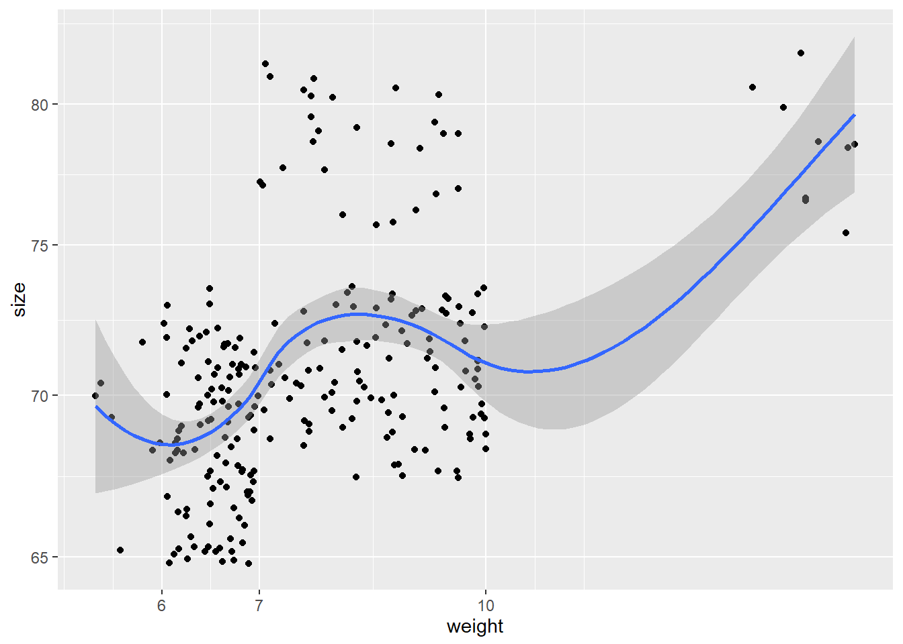
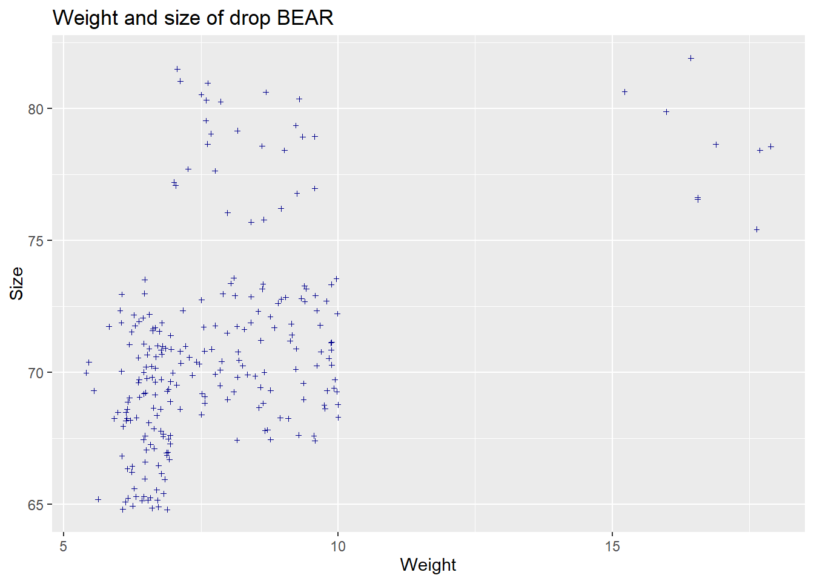
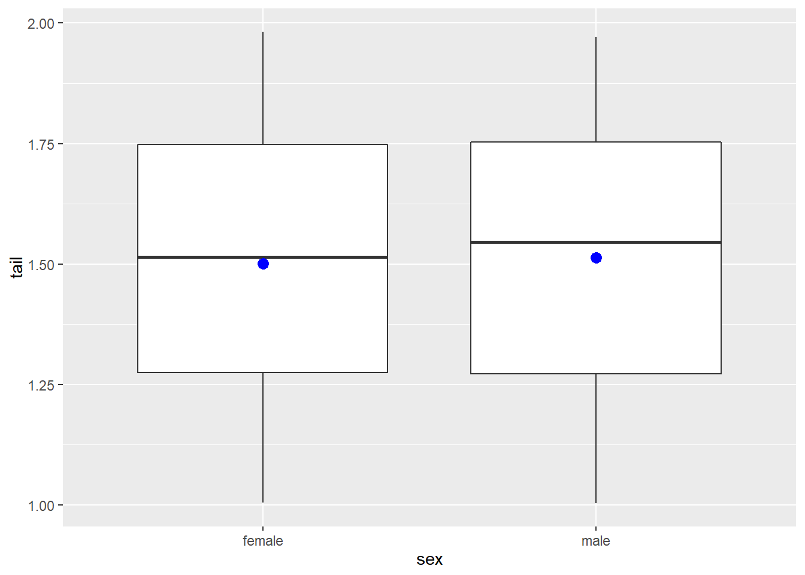
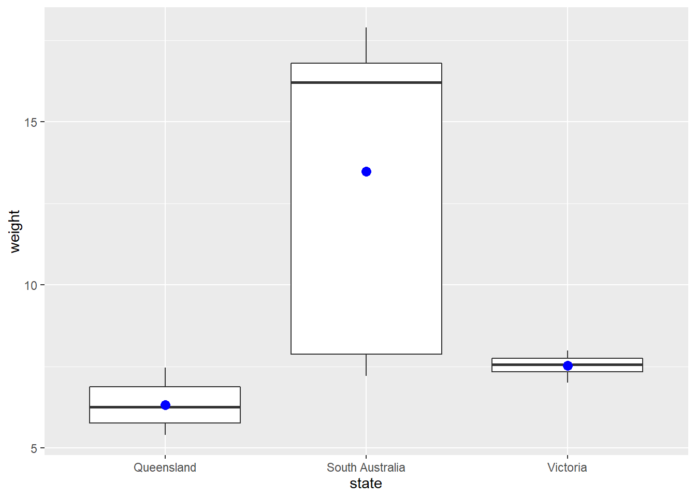

# Introduction to data visualization in `GGPLOT2`


Structure used by **ggplot** is basic.Identify data, specify a **mapping**, and then choose an appropriate **geometry** to display data.
+ is the key to constructing sophisticated ggplot2 graphics. It allows you to start simple, then get more and more complex, checking your work at each step.

aesthetic = variable describing which variables in the layer data should be mapped to which aesthetics used by the paired geom/stat. The expression variable is evaluated within the layer data, so there is no need to refer to the original dataset (i.e., use ggplot(df,aes(variable)) instead of ggplot(df,aes(df$variable))). The names for x and y aesthetics are typically omitted because they are so common; all other aesthetics must be
named.


```r
ggplot(data = koala)
```


```r
p <- ggplot(data = koala, mapping = aes(x = weight, y = size))
```

To see the individual points, specify the geometry that you would like to use. For **X,Y** data, X, Y, ... List of name value pairs. Elements must be either quoted calls, strings, onesided formulas or constants.
we can use **geom_point()**.


```r
p + geom_point()
```


```r
p + geom_smooth()
```

```
## `geom_smooth()` using method = 'loess' and formula 'y ~ x'
```


Add other features of the geom. Try playing around with shape=, size=, alpha=. 
*For shape*, use integer values from 0 to 20 (although there are many others to choose from). 
*For size*, use positive non-zero values (non-integers are OK). 
*For alpha*, use values from 0 to 1. You can use more than one of these at a time. 
Just separate them with commas in the geom statement.
We can also add nice (or more detailed) labelling. To do this we just need to add the labs component to the overall statement (like adding the geom_point() or geom_smooth). 


```
## `geom_smooth()` using formula 'y ~ x'
```


```
## `geom_smooth()` using method = 'loess' and formula 'y ~ x'
```



The boxplot compactly displays the distribution of a continuous variable. 
and ```coord_flip``` flips the x axis to y and reverse


```r
r<-ggplot(data=koala, mapping=aes(x=state, y=tail))
r+geom_boxplot()
```


```r
r+geom_boxplot()+coord_flip()
```


```Reorder``` is a generic function. The "default" method treats its first argument as a categorical variable, and reorders its levels based on the values of a second variable, usually numeric.


```r
r<-ggplot(data=koala, aes(x=reorder(state, tail), y=tail))
r+geom_boxplot()
```


```stat_summary``` operates on unique x; ```stat_summary_bin``` operates on binned x. They are more flexible versions of ```stat_bin()```: instead of just counting, they can compute any aggregate.


```r
ggplot(koala, aes(x=sex,y=tail))+geom_boxplot()+
  stat_summary(fun.y = mean,
               geom="point",
               size=3,color="blue")
```

```
## Warning: `fun.y` is deprecated. Use `fun` instead.
```



Reverse the condition logic
Its actually very simple with R and dplyr. 
Its **!(exclamation mark)**. And, it goes like this.


```r
koala%>% 
  filter(!state=="New South Wales")%>%
ggplot(aes(state,weight))+
  geom_boxplot(aes(x=state, y=weight)) + 
  stat_summary(fun.y = mean,
               geom="point",
               size=3,color="blue")
```

```
## Warning: `fun.y` is deprecated. Use `fun` instead.
```



# Introduction to linear models in R

linear regression model is represented as:


$$Y  = \beta_0 + \beta_1 X_1 + \beta_2 X_2 + \epsilon $$


Each of the model assumptions concerns the error term of the regression model. These are:

1. Individual observations are independent
2. Response data are normally distributed
3. Variance is homogeneous across range of predictor
4. Data are linear


```r
qplot(koala$weight)
```

```
## `stat_bin()` using `bins = 30`. Pick better value with `binwidth`.
```


```r
qplot(log(koala$weight))
```

```
## `stat_bin()` using `bins = 30`. Pick better value with `binwidth`.
```


```r
qplot(koala$fur)
```

```
## `stat_bin()` using `bins = 30`. Pick better value with `binwidth`.
```


```r
linearmodel<-lm(weight~fur, data=koala)
summary(linearmodel)
```

```
## 
## Call:
## lm(formula = weight ~ fur, data = koala)
## 
## Residuals:
##     Min      1Q  Median      3Q     Max 
## -3.8853 -1.0215 -0.2989  0.9245  8.4996 
## 
## Coefficients:
##             Estimate Std. Error t value Pr(>|t|)    
## (Intercept)   3.4409     0.4569   7.531 1.02e-12 ***
## fur           1.5477     0.1527  10.137  < 2e-16 ***
## ---
## Signif. codes:  0 '***' 0.001 '**' 0.01 '*' 0.05 '.' 0.1 ' ' 1
## 
## Residual standard error: 1.792 on 240 degrees of freedom
## Multiple R-squared:  0.2998,	Adjusted R-squared:  0.2969 
## F-statistic: 102.8 on 1 and 240 DF,  p-value: < 2.2e-16
```

```r
anova(linearmodel)
```

```
## Analysis of Variance Table
## 
## Response: weight
##            Df Sum Sq Mean Sq F value    Pr(>F)    
## fur         1 330.01  330.01  102.76 < 2.2e-16 ***
## Residuals 240 770.77    3.21                      
## ---
## Signif. codes:  0 '***' 0.001 '**' 0.01 '*' 0.05 '.' 0.1 ' ' 1
```

```r
check_model(linearmodel, check=c("qq", "normality", "ncv", "outliers")) 
```

```
## Not enough model terms in the conditional part of the model to check for multicollinearity.
```

```
## `geom_smooth()` using formula 'y ~ x'
```

```
## `geom_smooth()` using formula 'y ~ x'
```

```
## `stat_bin()` using `bins = 30`. Pick better value with `binwidth`.
```

```
## Warning: Removed 242 rows containing missing values (geom_text_repel).
```


```r
lm<-lm(size~fur, data=koala)
summary(lm)
```

```
## 
## Call:
## lm(formula = size ~ fur, data = koala)
## 
## Residuals:
##     Min      1Q  Median      3Q     Max 
## -7.1884 -2.3545 -0.2146  1.8404 10.1324 
## 
## Coefficients:
##             Estimate Std. Error t value Pr(>|t|)    
## (Intercept)   63.266      0.853  74.168   <2e-16 ***
## fur            2.650      0.285   9.295   <2e-16 ***
## ---
## Signif. codes:  0 '***' 0.001 '**' 0.01 '*' 0.05 '.' 0.1 ' ' 1
## 
## Residual standard error: 3.346 on 240 degrees of freedom
## Multiple R-squared:  0.2647,	Adjusted R-squared:  0.2616 
## F-statistic:  86.4 on 1 and 240 DF,  p-value: < 2.2e-16
```

```r
anova(lm)
```

```
## Analysis of Variance Table
## 
## Response: size
##            Df  Sum Sq Mean Sq F value    Pr(>F)    
## fur         1  967.19  967.19    86.4 < 2.2e-16 ***
## Residuals 240 2686.64   11.19                      
## ---
## Signif. codes:  0 '***' 0.001 '**' 0.01 '*' 0.05 '.' 0.1 ' ' 1
```

```r
check_model(lm, check=c("qq", "normality", "ncv", "outliers"))
```

```
## Not enough model terms in the conditional part of the model to check for multicollinearity.
```

```
## `geom_smooth()` using formula 'y ~ x'
## `geom_smooth()` using formula 'y ~ x'
```

```
## `stat_bin()` using `bins = 30`. Pick better value with `binwidth`.
```

```
## Warning: Removed 242 rows containing missing values (geom_text_repel).
```


**Correlation** is a statistical technique that can show whether and how strongly pairs of variables are related.The main result of a correlation is called the correlation coefficient (or "r"). It ranges from -1.0 to +1.0. The closer r is to +1 or -1, the more closely the two variables are related.


```r
corkoala<-koala %>% 
  select_if(is.numeric)%>%
  select(-c(1,2))

corMat<-cor(corkoala, use="complete.obs", method = "pearson")

corrplot(corMat, 
         method="shade",
         type="lower",
         diag = FALSE,
         addCoef.col = "black")
```


Determine if two or more samples are from the same population
-H0: 
  -Sample means are all equal(i.e.,  ??A= ) 
  -There is no effect of the factor on the response variablel
-If reject H0
  -Suggests that at least one sample mean is different from the others
-If don't reject H0
  -No evidence that any of the sample means are different from the overall population mean
  

```r
anova<-aov(weight~age, koala)
summary(anova)
```

```
##              Df Sum Sq Mean Sq F value Pr(>F)
## age           1    2.7   2.744     0.6  0.439
## Residuals   240 1098.0   4.575
```

```r
anova1<-aov(tail~age, koala)
summary(anova1)
```

```
##              Df Sum Sq Mean Sq F value Pr(>F)  
## age           1  0.344  0.3441   4.448  0.036 *
## Residuals   240 18.568  0.0774                 
## ---
## Signif. codes:  0 '***' 0.001 '**' 0.01 '*' 0.05 '.' 0.1 ' ' 1
```

```r
anova2<-aov(tail~age+sex, koala)
summary(anova)
```

```
##              Df Sum Sq Mean Sq F value Pr(>F)
## age           1    2.7   2.744     0.6  0.439
## Residuals   240 1098.0   4.575
```

```r
anova(anova, anova1, anova2, test="chi")
```

```
## Warning in anova.lmlist(object, ...): models with response 'c("tail", "tail")'
## removed because response differs from model 1
```

```
## Analysis of Variance Table
## 
## Response: weight
##            Df  Sum Sq Mean Sq F value Pr(>F)
## age         1    2.74  2.7436  0.5997 0.4395
## Residuals 240 1098.04  4.5752
```

Making a new variable to start with presence absence data

```ifelse``` returns a value with the same shape as test which is filled with elements selected from either yes or no depending on whether the element of test is TRUE or FALSE.

```mutate``` Mutate adds new variables and preserves existing; transmute drops existing variables.


```r
koala<-koala %>%
  mutate(presabs=ifelse(joey == "Yes","1","0"))

summary(as.factor(koala$presabs))
```

```
##   0   1 
## 185  57
```

A series of test/training partitions are created using ```createDataPartition``` 
Any supervised machine learning task require to split the data between a train set and a test set. You can create in the other supervised learning tutorials to create a train/test set.


```r
library(caret)
```

```
## Loading required package: lattice
```

```
## 
## Attaching package: 'caret'
```

```
## The following object is masked from 'package:purrr':
## 
##     lift
```

```r
set.seed(1234)
train <- createDataPartition(koala$presabs, 
                             time=1,#the number of partitions to create 
                             p = 0.7,#he percentage of data that goes to training
                             list=F)
data_train <- koala[train,]
data_test<- koala[-train,]
```

**Build the model **


```r
formula <- as.numeric(presabs)~fur+size+weight
pre <- glm(formula, data = data_train, family = 'binomial')
summary(pre)
```

```
## 
## Call:
## glm(formula = formula, family = "binomial", data = data_train)
## 
## Deviance Residuals: 
##      Min        1Q    Median        3Q       Max  
## -1.43208  -0.74687  -0.22938  -0.00134   2.00832  
## 
## Coefficients:
##             Estimate Std. Error z value Pr(>|z|)    
## (Intercept) 18.01763    5.03050   3.582 0.000341 ***
## fur          1.41075    0.41141   3.429 0.000606 ***
## size        -0.19116    0.07451  -2.565 0.010304 *  
## weight      -1.37326    0.39065  -3.515 0.000439 ***
## ---
## Signif. codes:  0 '***' 0.001 '**' 0.01 '*' 0.05 '.' 0.1 ' ' 1
## 
## (Dispersion parameter for binomial family taken to be 1)
## 
##     Null deviance: 185.50  on 169  degrees of freedom
## Residual deviance: 137.95  on 166  degrees of freedom
## AIC: 145.95
## 
## Number of Fisher Scoring iterations: 7
```

**Assess the performance of the model**
**Confusion Matrix**
The confusion matrix is a better choice to evaluate the classification performance compared with the different metrics you saw before. The general idea is to count the number of times True instances are classified are False.
To compute the confusion matrix, you first need to have a set of predictions so that they can be compared to the actual targets.

```r
predict <- predict(pre, data_test, type = 'response')
# confusion matrix
table_mat <- table(data_test$presabs, predict > 0.5)
table_mat
```

```
##    
##     FALSE TRUE
##   0    53    2
##   1    12    5
```
Each row in a confusion matrix represents an actual target, while each column represents a predicted target.
You can calculate the model accuracy by summing the true positive + true negative over the total observation


```r
accuracy_Test <- sum(diag(table_mat))/sum(table_mat)
accuracy_Test
```

```
## [1] 0.8055556
```
😸

