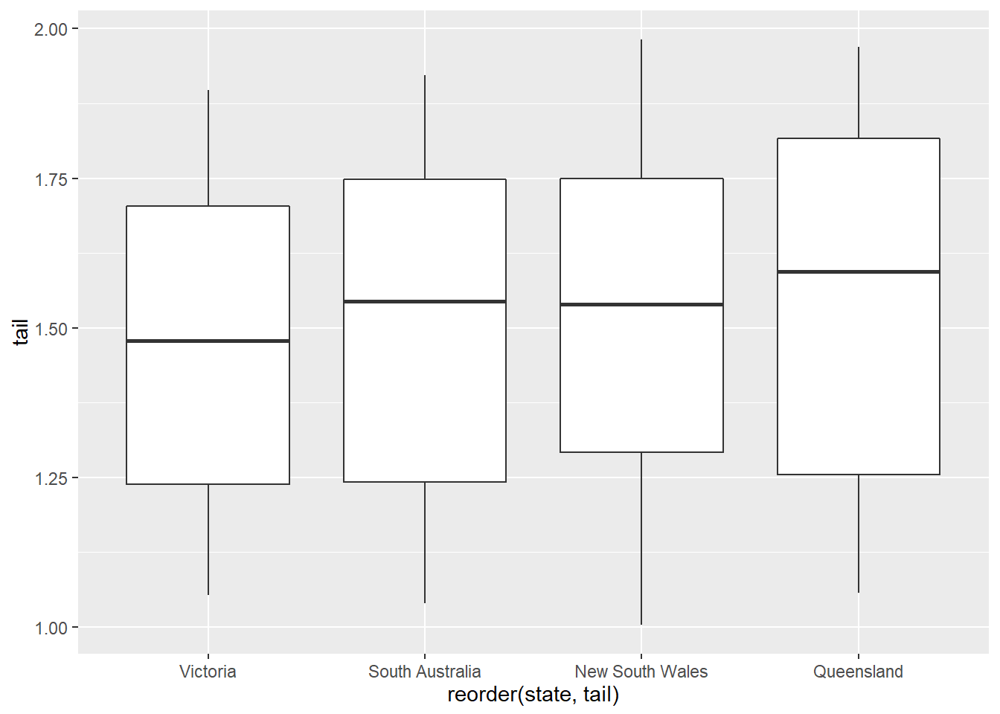
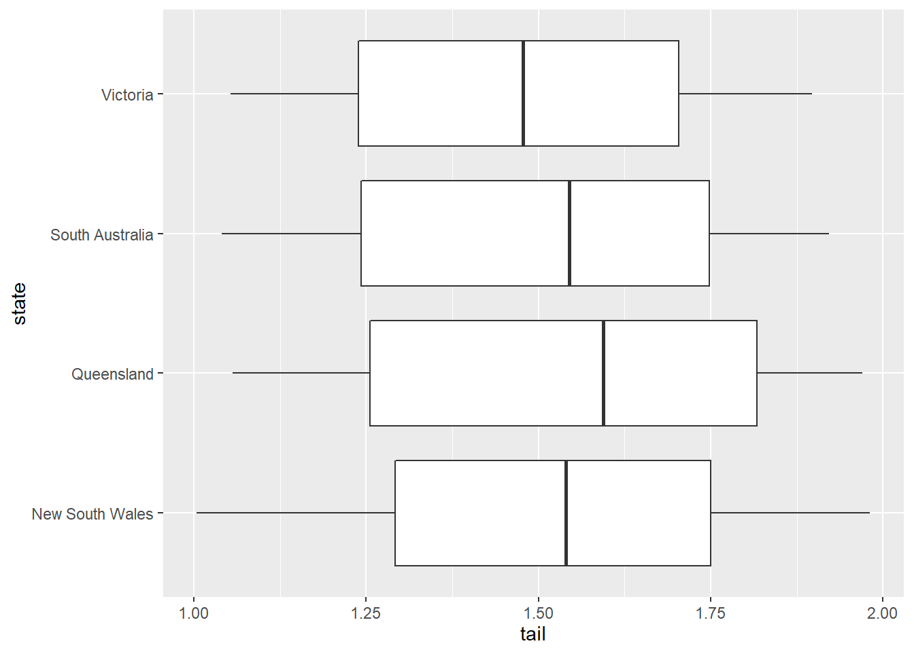

# Introduction to data visualization in `ggplot2`


## General information about **GGPLOT**

Working with **R** either with `ggplot` or *data analysis* there are three things which is most important and you will constantly go back and forth regarding three things:   
1. Writing code - you will write codes to produce graph, data analysis and also to load data   
2. Looking at output - your code is a set of instructions to produce graph, table or model  
3. Taking notes - write what you are doing and what it means 

### Package needed for the analysis

First we load the required packages (via `tidyverse`) and data:


```r
library(tidyverse)
```


```r
koala<-read.csv(file="data/koala.csv", stringsAsFactors = T)

#have a peek at the data structure

str(koala)
```

```
## 'data.frame':	242 obs. of  15 variables:
##  $ species: Factor w/ 1 level "Phascolarctos cinereus": 1 1 1 1 1 1 1 1 1 1 ...
##  $ X      : num  153 148 153 153 153 ...
##  $ Y      : num  -27.5 -22.5 -27.5 -27.5 -27.5 ...
##  $ state  : Factor w/ 4 levels "New South Wales",..: 2 2 2 2 2 2 2 2 2 2 ...
##  $ region : Factor w/ 2 levels "northern","southern": 1 1 1 1 1 1 1 1 1 1 ...
##  $ sex    : Factor w/ 2 levels "female","male": 2 1 2 2 1 2 2 2 1 1 ...
##  $ weight : num  7.12 5.45 6.63 6.47 5.62 ...
##  $ size   : num  70.8 70.4 68.7 73 65.2 ...
##  $ fur    : num  1.86 1.85 2.48 1.92 1.95 ...
##  $ tail   : num  1.17 1.56 1.06 1.8 1.63 ...
##  $ age    : int  8 10 1 1 10 12 9 1 1 1 ...
##  $ color  : Factor w/ 6 levels "chocolate brown",..: 3 4 6 3 4 4 6 4 3 3 ...
##  $ joey   : Factor w/ 2 levels "No","Yes": 1 2 1 1 1 1 1 1 1 1 ...
##  $ behav  : Factor w/ 3 levels "Feeding","Just Chillin",..: 3 3 2 3 3 1 2 3 1 3 ...
##  $ obs    : Factor w/ 3 levels "Opportunistic",..: 2 1 2 3 3 1 3 2 2 2 ...
```

```r
summary(koala)
```

```
##                    species          X               Y         
##  Phascolarctos cinereus:242   Min.   :138.6   Min.   :-39.00  
##                               1st Qu.:150.0   1st Qu.:-34.49  
##                               Median :152.0   Median :-32.67  
##                               Mean   :150.3   Mean   :-32.36  
##                               3rd Qu.:152.9   3rd Qu.:-30.31  
##                               Max.   :153.6   Max.   :-21.39  
##              state          region        sex          weight      
##  New South Wales:181   northern:165   female:127   Min.   : 5.406  
##  Queensland     : 16   southern: 77   male  :115   1st Qu.: 6.574  
##  South Australia: 14                               Median : 7.277  
##  Victoria       : 31                               Mean   : 7.923  
##                                                    3rd Qu.: 8.765  
##                                                    Max.   :17.889  
##       size            fur             tail            age       
##  Min.   :64.81   Min.   :1.110   Min.   :1.004   Min.   : 1.00  
##  1st Qu.:68.43   1st Qu.:2.410   1st Qu.:1.272   1st Qu.: 3.00  
##  Median :70.27   Median :2.797   Median :1.534   Median : 7.00  
##  Mean   :70.94   Mean   :2.896   Mean   :1.507   Mean   : 6.43  
##  3rd Qu.:72.33   3rd Qu.:3.217   3rd Qu.:1.750   3rd Qu.: 9.00  
##  Max.   :81.91   Max.   :5.876   Max.   :1.981   Max.   :12.00  
##              color     joey              behav                obs    
##  chocolate brown:21   No :185   Feeding     : 48   Opportunistic:65  
##  dark grey      :36   Yes: 57   Just Chillin: 67   Spotlighting :94  
##  grey           :69             Sleeping    :127   Stagwatching :83  
##  grey-brown     :53                                                  
##  light brown    :20                                                  
##  light grey     :43
```

### Be Patient with R and yourself, its not magic but rather work

Three specific things to watch out for:   
- Make sure parentheses are balanced and that every opening "(" has a corresponding closing ")"  
- Make sure you complete your expressions. If you think you have completed typing your code but instead of seeing the `>` command prompt at the console you see the + character, R thinks you haven't completed the expressions  
- In ggplot specifically, you will use `+` to add character. It should always be at the end of sentence rather then beginning   

**for eg:**  

ggplot(data, aes(x=x, y=y))+  geom_point()$\checkmark$

ggplot(data, aes(x=x, y=y))   
+geom_point() **X**


## Make your first Graph

Structure used by `ggplot` is basic.  Identify data, specify a `mapping`, and then choose an appropriate *geometry* to display data.
+ is the key to constructing sophisticated `ggplot2` graphics. It allows you to start simple, then get more and more complex, checking your work at each step.
*aesthetic = variable* describing which variables in the layer data should be mapped to which aesthetics used by the paired geom/stat. The expression variable is evaluated within the layer data, so there is no need to refer to the original dataset (i.e., use `ggplot(df,aes(variable)`) instead of `ggplot(df,aes(df$variable)))`. The names for x and y aesthetics are typically omitted because they are so common; all other aesthetics must be named.


```r
koala<-read.csv(file="data/koala.csv", stringsAsFactors = T)

ggplot(data = koala)
```


```r
p <- ggplot(data = koala, mapping = aes(x = size, y = weight))
```

## `geom_point`
To see the individual points, specify the `geometry` that you would like to use. For *X,Y* data X, Y. List of name value pairs. Elements must be either quoted calls, strings, one-sided formulas or constants.
we can use `geom_point()`.


```r
p + geom_point()
```


```r
p + geom_smooth()
```

```
## `geom_smooth()` using method = 'loess' and formula 'y ~ x'
```


```r
p+geom_point()+geom_smooth()
```

```
## `geom_smooth()` using method = 'loess' and formula 'y ~ x'
```


  
Add other features of the geom. Try playing around with shape=, size=, alpha=. 
*For shape*, use integer values from 0 to 20 (although there are many others to choose from). 
*For size*, use positive non-zero values (non-integers are OK). 
*For alpha*, use values from 0 to 1. You can use more than one of these at a time. 
Just separate them with commas in the geom statement.
We can also add nice (or more detailed) labeling. To do this we just need to add the labs component to the overall statement (like adding the geom_point() or geom_smooth). 


```
## `geom_smooth()` using formula 'y ~ x'
```


```
## `geom_smooth()` using method = 'loess' and formula 'y ~ x'
```


## Challenge 1

- plot tail length with fur thickness and color it by sex and change the
- x and y axis labels and add your title. Funniest title wins the prize.

### `geom_boxplot`


```r
r<-ggplot(data=koala, aes(x=state, y=tail))
r+geom_boxplot()
```


```Reorder``` is a generic function. The "default" method treats its first argument as a categorical variable, and reorders its levels based on the values of a second variable, usually numeric.


```r
r<-ggplot(data=koala, aes(x=reorder(state, tail), y=tail))
r+geom_boxplot()
```



```stat_summary``` operates on unique x; ```stat_summary_bin``` operates on binned x. They are more flexible versions of ```stat_bin()```: instead of just counting, they can compute any aggregate.


```r
ggplot(koala, aes(x=sex,y=tail))+geom_boxplot()+
  stat_summary(fun = mean,
               geom="point",
               size=3,
               color="red")
```


### `coord_flip`

boxplot compactly displays the distribution of a continuous variable. 
and ```coord_flip``` flips the x axis to y and reverse


```r
r<-ggplot(data=koala, mapping=aes(x=state, y=tail))
r+geom_boxplot()
```


```r
r+geom_boxplot()+coord_flip()
```



### `facet_wrap`
If we want three different types of information for the graph. Lets try that


```r
ggplot(koala, aes(x=sex, y=weight, color=state))+
  geom_boxplot()+
  facet_wrap(~state)+
  labs(title="Weight of Koala in Australia", x="Sex of Koala", y="Weight of animal")+
  coord_flip()
```


### Reverse the condition logic

Its actually very simple with R and dplyr. 
Its **!(exclamation mark)**. And, it goes like this.


```r
koala%>% 
  filter(!state=="New South Wales")%>%
ggplot(aes(state,tail)) + 
  geom_boxplot()+
  stat_summary(fun.y = mean,
               geom="point",
               size=3,color="blue")
```


## Challenge2  

- put your dplyr and ggplot knowledge to the test   
- plot the weights of koalas from all states except Victoria as a boxplot!  
- add the fun to illustrate the mean, change the color of this point  


```r
koala%>% 
  filter(!state=="Victoria")%>%
ggplot(aes(state,weight))+
  geom_boxplot(aes(x=state, y=weight)) + 
  stat_summary(fun= mean,
               geom="point",
               size=3,color="blue")
```


 

## Challenge3   

- dplyr and ggplot together remove the weight higher than 3rd quartile    
- plot weight and size with method glm label the axis   
- have a tile and state as colour  
  

```r
summary(koala)
```

```
##                    species          X               Y         
##  Phascolarctos cinereus:242   Min.   :138.6   Min.   :-39.00  
##                               1st Qu.:150.0   1st Qu.:-34.49  
##                               Median :152.0   Median :-32.67  
##                               Mean   :150.3   Mean   :-32.36  
##                               3rd Qu.:152.9   3rd Qu.:-30.31  
##                               Max.   :153.6   Max.   :-21.39  
##              state          region        sex          weight      
##  New South Wales:181   northern:165   female:127   Min.   : 5.406  
##  Queensland     : 16   southern: 77   male  :115   1st Qu.: 6.574  
##  South Australia: 14                               Median : 7.277  
##  Victoria       : 31                               Mean   : 7.923  
##                                                    3rd Qu.: 8.765  
##                                                    Max.   :17.889  
##       size            fur             tail            age       
##  Min.   :64.81   Min.   :1.110   Min.   :1.004   Min.   : 1.00  
##  1st Qu.:68.43   1st Qu.:2.410   1st Qu.:1.272   1st Qu.: 3.00  
##  Median :70.27   Median :2.797   Median :1.534   Median : 7.00  
##  Mean   :70.94   Mean   :2.896   Mean   :1.507   Mean   : 6.43  
##  3rd Qu.:72.33   3rd Qu.:3.217   3rd Qu.:1.750   3rd Qu.: 9.00  
##  Max.   :81.91   Max.   :5.876   Max.   :1.981   Max.   :12.00  
##              color     joey              behav                obs    
##  chocolate brown:21   No :185   Feeding     : 48   Opportunistic:65  
##  dark grey      :36   Yes: 57   Just Chillin: 67   Spotlighting :94  
##  grey           :69             Sleeping    :127   Stagwatching :83  
##  grey-brown     :53                                                  
##  light brown    :20                                                  
##  light grey     :43
```

```r
koala %>% 
  filter(weight<=8.76)%>%
ggplot(aes(size,weight, color=state))+
  geom_point() + 
  geom_smooth(method='glm', se=F)+labs(title="Weight vs Size", x= "Weight", y="Size")
```

```
## `geom_smooth()` using formula 'y ~ x'
```


