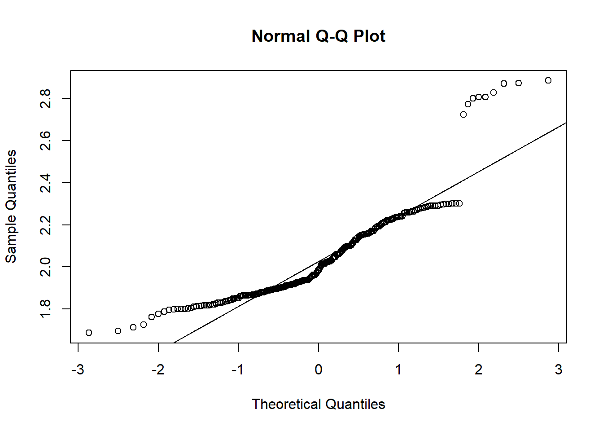
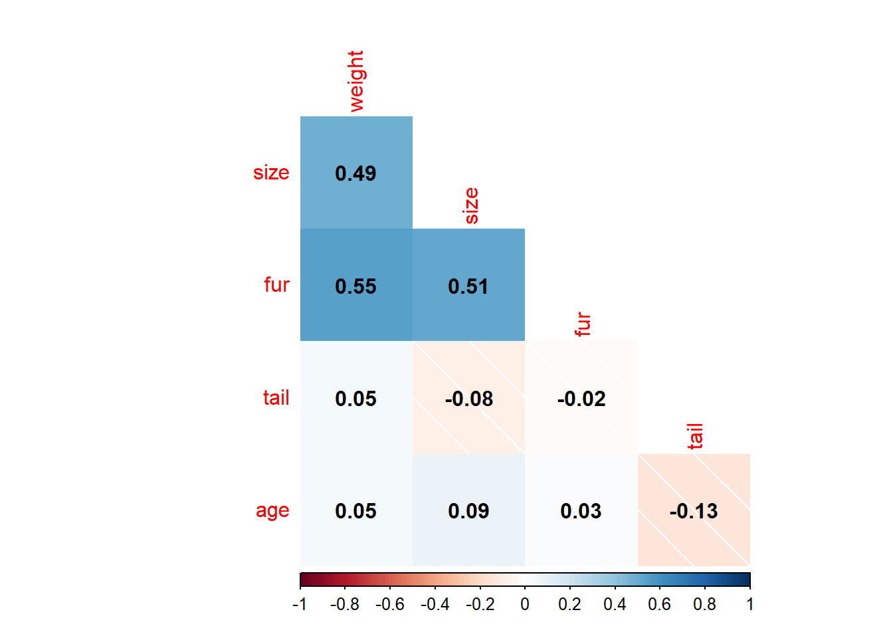
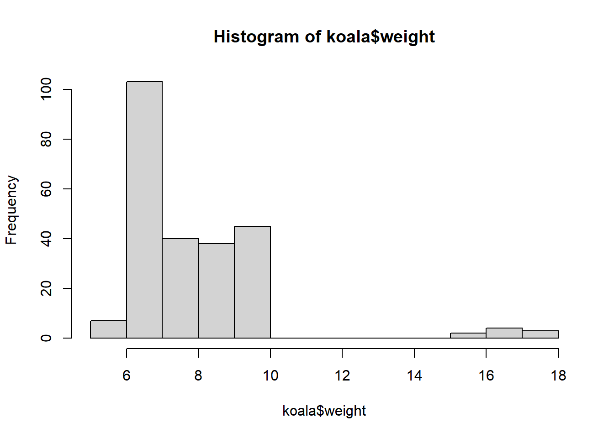
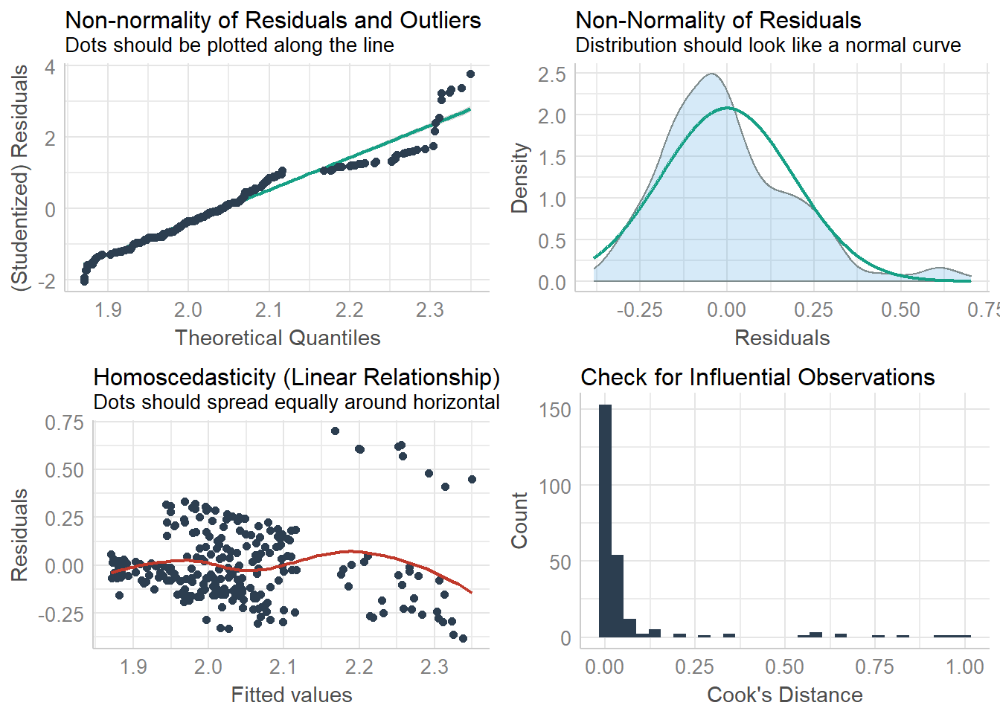

# Introduction to linear models in R


Let's first load packages and data:


```r
library(performance)
library(corrplot)
library(emojifont)
library(tidyverse)
```


```r
koala<-read.csv(file="data/koala.csv", stringsAsFactors = T)

#have a peek at the data structure

str(koala)
```

```
## 'data.frame':	242 obs. of  15 variables:
##  $ species: Factor w/ 1 level "Phascolarctos cinereus": 1 1 1 1 1 1 1 1 1 1 ...
##  $ X      : num  153 148 153 153 153 ...
##  $ Y      : num  -27.5 -22.5 -27.5 -27.5 -27.5 ...
##  $ state  : Factor w/ 4 levels "New South Wales",..: 2 2 2 2 2 2 2 2 2 2 ...
##  $ region : Factor w/ 2 levels "northern","southern": 1 1 1 1 1 1 1 1 1 1 ...
##  $ sex    : Factor w/ 2 levels "female","male": 2 1 2 2 1 2 2 2 1 1 ...
##  $ weight : num  7.12 5.45 6.63 6.47 5.62 ...
##  $ size   : num  70.8 70.4 68.7 73 65.2 ...
##  $ fur    : num  1.86 1.85 2.48 1.92 1.95 ...
##  $ tail   : num  1.17 1.56 1.06 1.8 1.63 ...
##  $ age    : int  8 10 1 1 10 12 9 1 1 1 ...
##  $ color  : Factor w/ 6 levels "chocolate brown",..: 3 4 6 3 4 4 6 4 3 3 ...
##  $ joey   : Factor w/ 2 levels "No","Yes": 1 2 1 1 1 1 1 1 1 1 ...
##  $ behav  : Factor w/ 3 levels "Feeding","Just Chillin",..: 3 3 2 3 3 1 2 3 1 3 ...
##  $ obs    : Factor w/ 3 levels "Opportunistic",..: 2 1 2 3 3 1 3 2 2 2 ...
```

```r
summary(koala)
```

```
##                    species          X               Y         
##  Phascolarctos cinereus:242   Min.   :138.6   Min.   :-39.00  
##                               1st Qu.:150.0   1st Qu.:-34.49  
##                               Median :152.0   Median :-32.67  
##                               Mean   :150.3   Mean   :-32.36  
##                               3rd Qu.:152.9   3rd Qu.:-30.31  
##                               Max.   :153.6   Max.   :-21.39  
##              state          region        sex          weight      
##  New South Wales:181   northern:165   female:127   Min.   : 5.406  
##  Queensland     : 16   southern: 77   male  :115   1st Qu.: 6.574  
##  South Australia: 14                               Median : 7.277  
##  Victoria       : 31                               Mean   : 7.923  
##                                                    3rd Qu.: 8.765  
##                                                    Max.   :17.889  
##       size            fur             tail            age       
##  Min.   :64.81   Min.   :1.110   Min.   :1.004   Min.   : 1.00  
##  1st Qu.:68.43   1st Qu.:2.410   1st Qu.:1.272   1st Qu.: 3.00  
##  Median :70.27   Median :2.797   Median :1.534   Median : 7.00  
##  Mean   :70.94   Mean   :2.896   Mean   :1.507   Mean   : 6.43  
##  3rd Qu.:72.33   3rd Qu.:3.217   3rd Qu.:1.750   3rd Qu.: 9.00  
##  Max.   :81.91   Max.   :5.876   Max.   :1.981   Max.   :12.00  
##              color     joey              behav                obs    
##  chocolate brown:21   No :185   Feeding     : 48   Opportunistic:65  
##  dark grey      :36   Yes: 57   Just Chillin: 67   Spotlighting :94  
##  grey           :69             Sleeping    :127   Stagwatching :83  
##  grey-brown     :53                                                  
##  light brown    :20                                                  
##  light grey     :43
```

The main object of this session is to show how to perform basic regression
analysis, including plots for model checking and display of confidence
and prediction intervals.


linear regression model is represented as:
$$Y=a+bX$$

X is the explanatory variable and Y is the dependent variable. The slope of the line is b, and a is the intercept (the value of y when x = 0).


$$Y  = \sigma + \beta X_1 +  \epsilon $$

The parameters $\alpha$, $\beta$ , and $\epsilon$ can be estimated using the method of least squares. 

## Model Assumptions 

Each of the model assumptions concerns the error term of the regression model. These are:

1. Individual observations are independent
2. Response data are normally distributed
3. Variance is homogeneous across range of predictor
4. Data are linear


```r
koala<-read.csv(file="data/koala.csv", stringsAsFactors = T)

qplot(koala$weight)
```

```
## `stat_bin()` using `bins = 30`. Pick better value with `binwidth`.
```


```r
qplot(log(koala$weight))
```

```
## `stat_bin()` using `bins = 30`. Pick better value with `binwidth`.
```


```r
qqnorm(koala$weight)
qqline(koala$weight)### look at the line for the pattern
```


```r
### qqplot with log transformed data
qqnorm(log(koala$weight))
qqline(log(koala$weight))
```



```r
qplot(log(koala$weight))
```

```
## `stat_bin()` using `bins = 30`. Pick better value with `binwidth`.
```


```r
qplot(koala$fur)
```

```
## `stat_bin()` using `bins = 30`. Pick better value with `binwidth`.
```


## Linear model  
The `lm` function handles much more complicated models than simple linear
regression. There can be many other things besides a dependent and a
descriptive variable in a model formula.


```r
lm<-lm(size~fur, data=koala)
summary(lm)
```

```
## 
## Call:
## lm(formula = size ~ fur, data = koala)
## 
## Residuals:
##     Min      1Q  Median      3Q     Max 
## -7.1884 -2.3545 -0.2146  1.8404 10.1324 
## 
## Coefficients:
##             Estimate Std. Error t value Pr(>|t|)    
## (Intercept)   63.266      0.853  74.168   <2e-16 ***
## fur            2.650      0.285   9.295   <2e-16 ***
## ---
## Signif. codes:  0 '***' 0.001 '**' 0.01 '*' 0.05 '.' 0.1 ' ' 1
## 
## Residual standard error: 3.346 on 240 degrees of freedom
## Multiple R-squared:  0.2647,	Adjusted R-squared:  0.2616 
## F-statistic:  86.4 on 1 and 240 DF,  p-value: < 2.2e-16
```

```r
confint(lm)
```

```
##                 2.5 %    97.5 %
## (Intercept) 61.585132 64.945776
## fur          2.088061  3.211097
```

```r
check_model(lm, check=c("qq", "normality", "ncv", "outliers"))
```

```
## Not enough model terms in the conditional part of the model to check for multicollinearity.
```

```
## `geom_smooth()` using formula 'y ~ x'
## `geom_smooth()` using formula 'y ~ x'
```

```
## `stat_bin()` using `bins = 30`. Pick better value with `binwidth`.
```


  
## Correlation    
A **Correlation** coefficient is a symmetric, scale-invariant measure of association between two random variables. It ranges from -1 to +1, where the extremes indicate perfect correlation and 0 means no correlation. The sign is negative when large values of one variable are associated with small values of the other and positive if both variables tend to be large or small simultaneously. The reader should be warned that there are many incorrect uses of correlation coefficients, particularly when they are used in regression type settings.

Correlation is a statistical technique that can show whether and how strongly pairs of variables are related.The main result of a correlation is called the correlation coefficient (or "r"). It ranges from -1.0 to +1.0. The closer r is to +1 or -1, the more closely the two variables are related.


```r
corkoala<-koala %>% 
  select_if(is.numeric)%>%
  select(-c(1,2))

corMat<-cor(corkoala, use="complete.obs", method = "pearson")

corrplot(corMat, 
         method="shade",
         type="lower",
         diag = FALSE,
         addCoef.col = "black")
```



  
## Statistical Hypothesis  

Determine if two or more samples are from the same population  
H0:  
  -Sample means are all equal(i.e., A= )   
  -There is no effect of the factor on the response variable  
If reject H0  
  -Suggests that at least one sample mean is different from the others  
If don't reject H0  
  -No evidence that any of the sample means are different from the overall population mean
  
## ANOVA

Test for significant differences between the group means can be
performed by comparing two variance estimates. This is why the procedure
is called analysis of variance even though the objective is to compare
the group means.There are multiple ways of representing the effect of a factor variable in linear models (and one-way analysis of variance is the simplest example of a linear model with a factor variable).


  

```r
summary(koala)
```

```
##                    species          X               Y         
##  Phascolarctos cinereus:242   Min.   :138.6   Min.   :-39.00  
##                               1st Qu.:150.0   1st Qu.:-34.49  
##                               Median :152.0   Median :-32.67  
##                               Mean   :150.3   Mean   :-32.36  
##                               3rd Qu.:152.9   3rd Qu.:-30.31  
##                               Max.   :153.6   Max.   :-21.39  
##              state          region        sex          weight      
##  New South Wales:181   northern:165   female:127   Min.   : 5.406  
##  Queensland     : 16   southern: 77   male  :115   1st Qu.: 6.574  
##  South Australia: 14                               Median : 7.277  
##  Victoria       : 31                               Mean   : 7.923  
##                                                    3rd Qu.: 8.765  
##                                                    Max.   :17.889  
##       size            fur             tail            age       
##  Min.   :64.81   Min.   :1.110   Min.   :1.004   Min.   : 1.00  
##  1st Qu.:68.43   1st Qu.:2.410   1st Qu.:1.272   1st Qu.: 3.00  
##  Median :70.27   Median :2.797   Median :1.534   Median : 7.00  
##  Mean   :70.94   Mean   :2.896   Mean   :1.507   Mean   : 6.43  
##  3rd Qu.:72.33   3rd Qu.:3.217   3rd Qu.:1.750   3rd Qu.: 9.00  
##  Max.   :81.91   Max.   :5.876   Max.   :1.981   Max.   :12.00  
##              color     joey              behav                obs    
##  chocolate brown:21   No :185   Feeding     : 48   Opportunistic:65  
##  dark grey      :36   Yes: 57   Just Chillin: 67   Spotlighting :94  
##  grey           :69             Sleeping    :127   Stagwatching :83  
##  grey-brown     :53                                                  
##  light brown    :20                                                  
##  light grey     :43
```

```r
anova<-aov(weight~sex, koala)
summary(anova)
```

```
##              Df Sum Sq Mean Sq F value Pr(>F)    
## sex           1  418.9   418.9   147.4 <2e-16 ***
## Residuals   240  681.9     2.8                   
## ---
## Signif. codes:  0 '***' 0.001 '**' 0.01 '*' 0.05 '.' 0.1 ' ' 1
```

```r
anova1<-aov(tail~sex, koala)
summary(anova1)
```

```
##              Df Sum Sq Mean Sq F value Pr(>F)
## sex           1   0.01 0.01047   0.133  0.716
## Residuals   240  18.90 0.07876
```

```r
TukeyHSD(anova1)
```

```
##   Tukey multiple comparisons of means
##     95% family-wise confidence level
## 
## Fit: aov(formula = tail ~ sex, data = koala)
## 
## $sex
##                  diff        lwr        upr     p adj
## male-female 0.0131722 -0.0579901 0.08433451 0.7157089
```

```r
anova(anova, anova1, test="chi")
```

```
## Analysis of Variance Table
## 
## Response: weight
##            Df Sum Sq Mean Sq F value    Pr(>F)    
## sex         1 418.89  418.89  147.43 < 2.2e-16 ***
## Residuals 240 681.90    2.84                      
## ---
## Signif. codes:  0 '***' 0.001 '**' 0.01 '*' 0.05 '.' 0.1 ' ' 1
```

## **Build the model **  

### GLM  

Advantages of GLMs over traditional regression  
- We do not need to transform the response Y to have a normal distribution  
- The choice of link is separate from the choice of random component thus we have more flexibility in modeling  
- If the link produces additive effects, then we do not need constant variance.  
- The models are fitted via Maximum Likelihood estimation; thus optimal properties of the estimators.  
- All the inference tools and model checking that we will discuss for log-linear and logistic regression models apply for other GLMs too; e.g., Wald and Likelihood ratio tests, Deviance, Residuals, Confidence intervals, Overdispersion.  
- There is often one procedure in a software package to capture all the models listed above, e.g. PROC GENMOD in SAS or glm() in R, etc... with options to vary the three components.  
  
### But there are some limitations of GLMs too, such as,

- Linear function, e.g. can have only a linear predictor in the systematic component  
- Responses must be independent  


```r
hist(koala$size)
```


```r
hist(log(koala$size))
```


```r
hist(koala$weight)
```



```r
hist(log(koala$weight))
```


```r
summary(koala$size)
```

```
##    Min. 1st Qu.  Median    Mean 3rd Qu.    Max. 
##   64.81   68.43   70.27   70.94   72.33   81.91
```

```r
weight_sizemodel<-glm(log(weight)~size,family=gaussian(link='identity'),data=koala)
summary(weight_sizemodel)
```

```
## 
## Call:
## glm(formula = log(weight) ~ size, family = gaussian(link = "identity"), 
##     data = koala)
## 
## Deviance Residuals: 
##      Min        1Q    Median        3Q       Max  
## -0.38285  -0.13252  -0.02833   0.09998   0.70169  
## 
## Coefficients:
##             Estimate Std. Error t value Pr(>|t|)    
## (Intercept) 0.054962   0.225778   0.243    0.808    
## size        0.028017   0.003178   8.816 2.47e-16 ***
## ---
## Signif. codes:  0 '***' 0.001 '**' 0.01 '*' 0.05 '.' 0.1 ' ' 1
## 
## (Dispersion parameter for gaussian family taken to be 0.0369023)
## 
##     Null deviance: 11.7246  on 241  degrees of freedom
## Residual deviance:  8.8566  on 240  degrees of freedom
## AIC: -107.72
## 
## Number of Fisher Scoring iterations: 2
```

```r
anova(weight_sizemodel)
```

```
## Analysis of Deviance Table
## 
## Model: gaussian, link: identity
## 
## Response: log(weight)
## 
## Terms added sequentially (first to last)
## 
## 
##      Df Deviance Resid. Df Resid. Dev
## NULL                   241    11.7246
## size  1    2.868       240     8.8566
```

```r
check_model(weight_sizemodel, check=c("qq", "normality", "ncv", "outliers")) 
```

```
## Not enough model terms in the conditional part of the model to check for multicollinearity.
```

```
## `geom_smooth()` using formula 'y ~ x'
## `geom_smooth()` using formula 'y ~ x'
```

```
## `stat_bin()` using `bins = 30`. Pick better value with `binwidth`.
```



```r
confint(weight_sizemodel)
```

```
## Waiting for profiling to be done...
```

```
##                   2.5 %     97.5 %
## (Intercept) -0.38755522 0.49747923
## size         0.02178785 0.03424534
```

```r
prediction_matrix <- cbind.data.frame(size = 60:90)
prediction_matrix$lp <- 0.054962 + 0.028017 * prediction_matrix$size
prediction_matrix$mu <- exp(prediction_matrix$lp)
ggplot(data = koala, aes(x = size, y =weight)) + geom_point() + geom_smooth(method="glm")+
  geom_line(data = prediction_matrix, aes(size, mu))
```

```
## `geom_smooth()` using formula 'y ~ x'
```


😸

