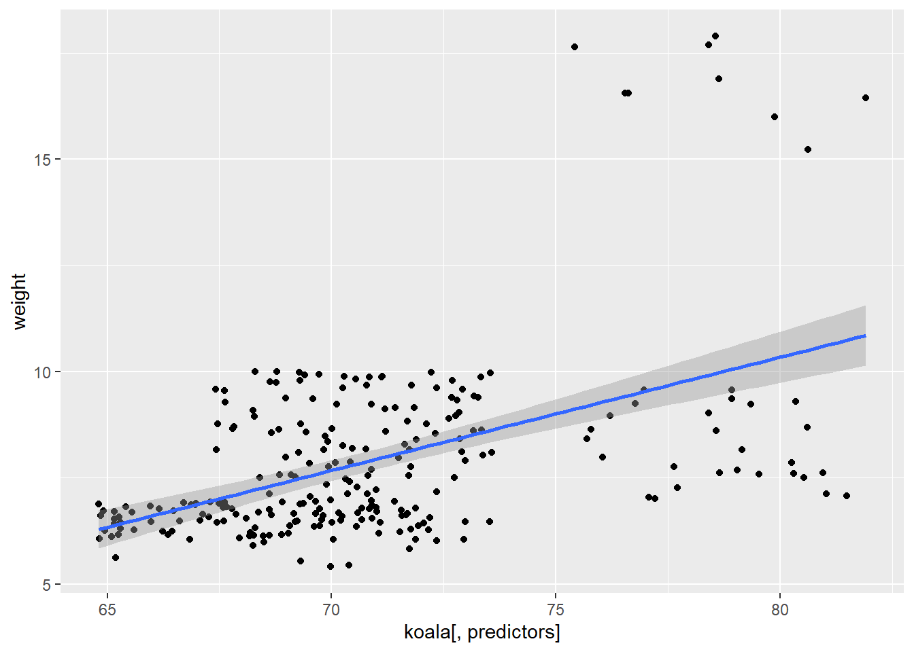
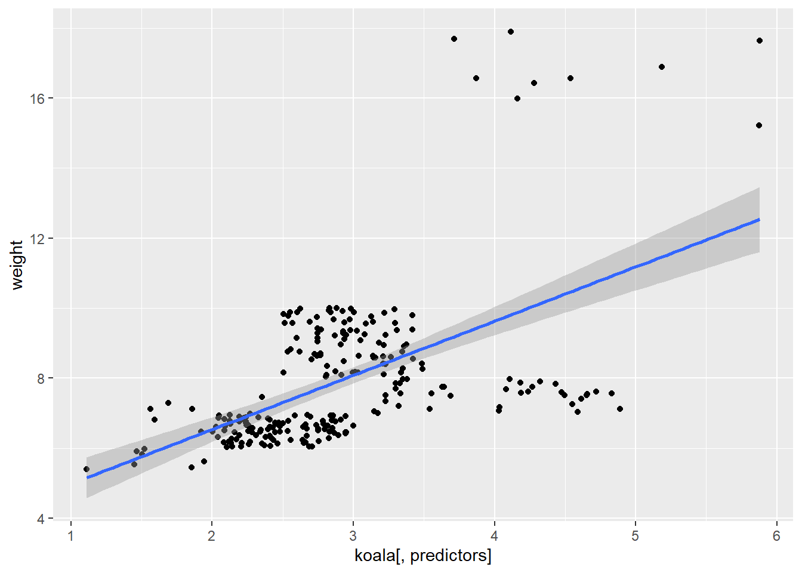
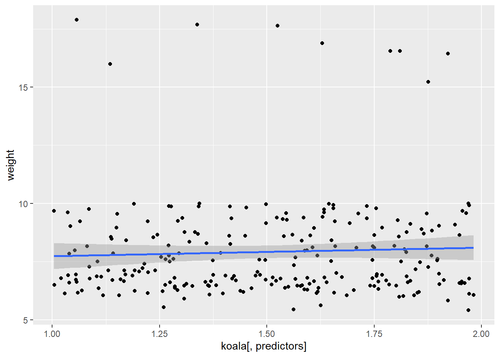
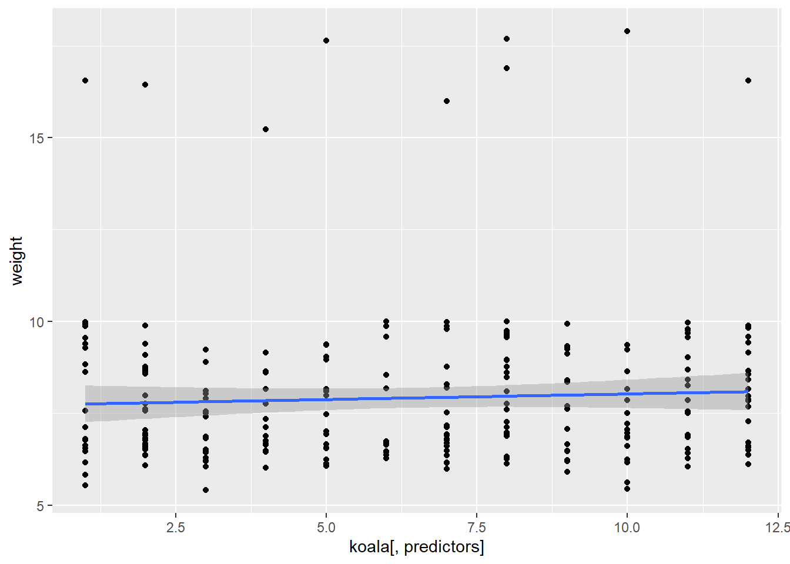
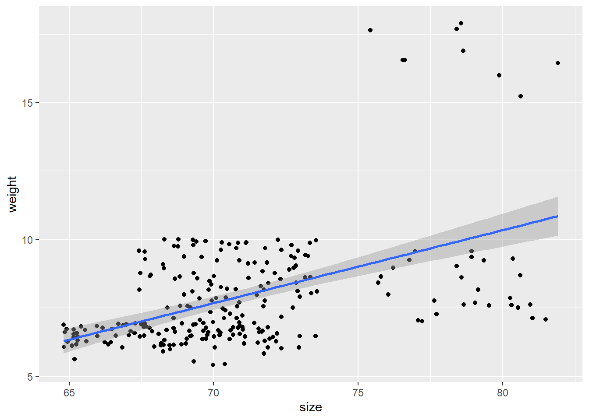
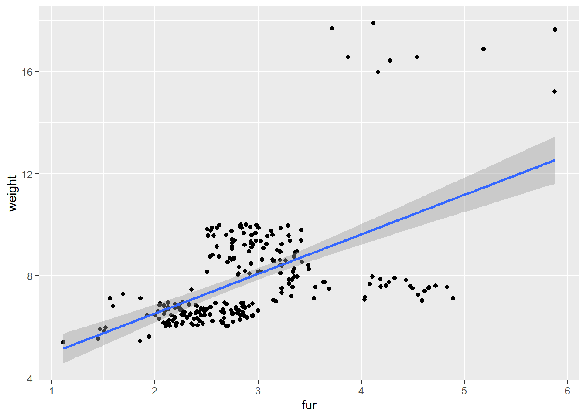
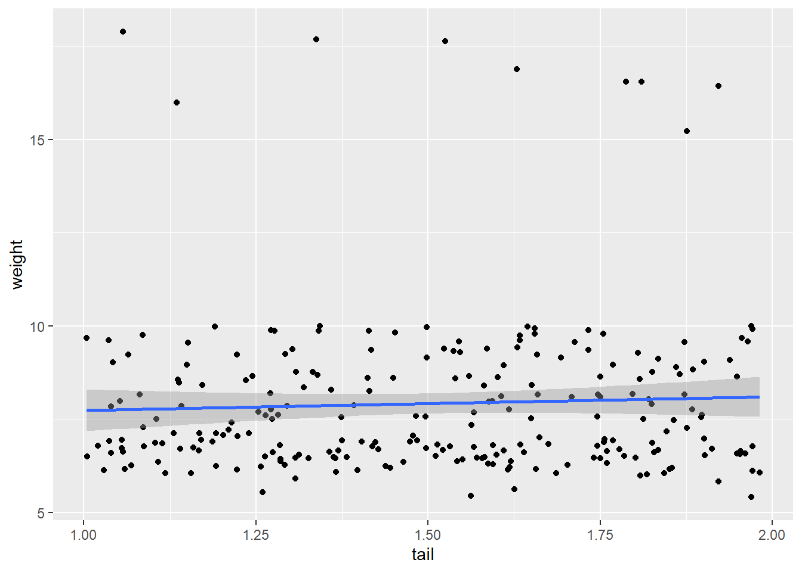
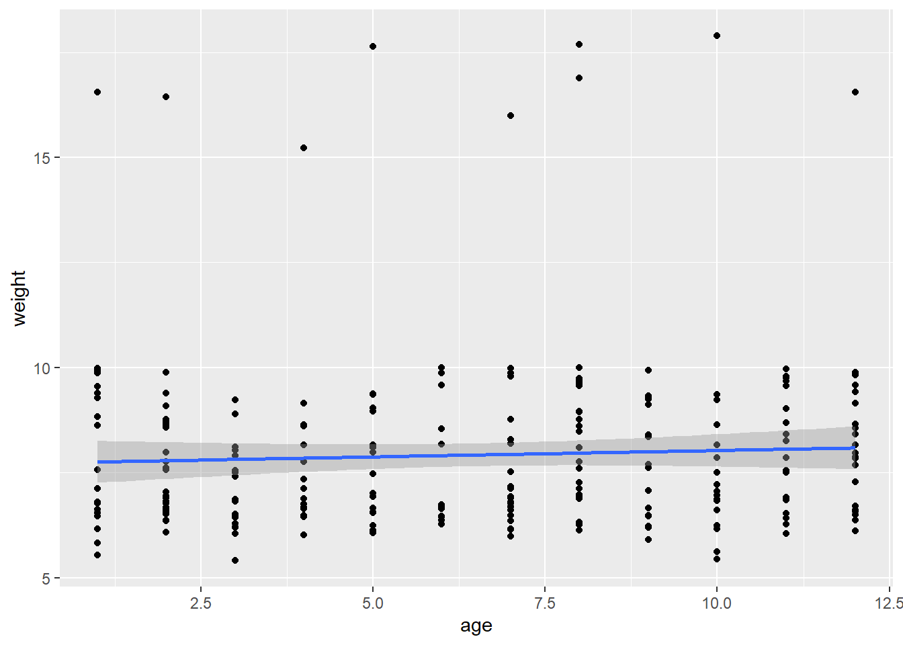

# Loops and `apply`
## Introduction

Data analysis often requires repeating a particular function on multiple data observations, groups of observations, or separate data sets. Many novice users begin with the strategy of assigning a new variable for each input, or copying and pasting code. While this certainly works, it can be very time consuming and makes it easy to make silly mistakes. There are several alternative strategies that can be used to repeat tasks for multiple variables or data sets that avoid this risk.

In this tutorial, we will focus on the `apply` family of functions and introduce loops. We will build on the skills we learned in our previous tutorials using `dplyr` and `ggplot2`, so if you are unfamiliar with the `tidyverse` syntax, it would be helpful to review these sections.

## So, what do you want to repeat?

For any given task, there are several possible approaches for how to repeat it. In general, the first point to consider is whether the order of iteration matters or if it does not matter.

What does this mean?

Let's consider an example from our previous tutorial. We built a model using one predictor variable, but we would like to compare this model to models built using other predictor variables. In this situation, it doesn't matter whether we build model A before we build model B-- they are completely independent of each other. Here, the order of iteration does *not* matter.

Now consider a situation where our process has several steps. Perhaps we need to generate a data set A and save that data set to be used to calculate B, then use B to calculate C. In this situation, the sequence *does* matter.

In situations where the sequence does not matter, you can use `apply` functions. If the sequence does matter, you will need to use a loop.

## DON'T USE A LOOP WHEN YOU CAN USE APPLY!

Loops can be very useful, but can be complicated, messy, and easy to break. They are also harder to troubleshoot. The loop may run without producing the desired output and it can be difficult to figure out why. It is FAR more common that the order of iteration does not matter, and even if it does matter, a well-written function can usually help you avoid needing a loop!

`apply` functions are simple and clean and more difficult to mess up! If you can use one instead of a loop, you should!


## The `apply` family

Ok, so what is `apply`? 

The `apply` functions are a set of functions that can be used to, well, apply functions to lists, dataframes, and matrices. `apply` functions are similar to loops, but have a much simpler syntax.

There are several different functions that can be used depending upon the inputs and desired outputs. These include:

1. `apply` - used with arrays, including matrices, and returns a vector, array, or list.
2. `sapply` - (simplified apply) applies the function to each element of a vector, list, or matrix, and returns the outputs as a vector or matrix.
3. `lapply` - (list apply) is similar to `sapply`, but returns a list of objects, rather than a vector.
4. `mapply` - (multivariate apply) applies a function to the first elements of two or more vectors or lists, and then the second pair of elements, etc..

If this doesn't make much sense, don't stress! We will work through `sapply` and `lapply`.

### `sapply`

Let's take a quick look at our koala dataset.


```r
koala <- read.csv('data/koala.csv')

names(koala)
```

```
##  [1] "species" "X"       "Y"       "state"   "region"  "sex"     "weight" 
##  [8] "size"    "fur"     "tail"    "age"     "color"   "joey"    "behav"  
## [15] "obs"
```

In a previous section, we built a linear model that predicted weight based on fur.


```r
linearmodel<-lm(weight~fur, data=koala)
summary(linearmodel)
```

```
## 
## Call:
## lm(formula = weight ~ fur, data = koala)
## 
## Residuals:
##     Min      1Q  Median      3Q     Max 
## -3.8853 -1.0215 -0.2989  0.9245  8.4996 
## 
## Coefficients:
##             Estimate Std. Error t value Pr(>|t|)    
## (Intercept)   3.4409     0.4569   7.531 1.02e-12 ***
## fur           1.5477     0.1527  10.137  < 2e-16 ***
## ---
## Signif. codes:  0 '***' 0.001 '**' 0.01 '*' 0.05 '.' 0.1 ' ' 1
## 
## Residual standard error: 1.792 on 240 degrees of freedom
## Multiple R-squared:  0.2998,	Adjusted R-squared:  0.2969 
## F-statistic: 102.8 on 1 and 240 DF,  p-value: < 2.2e-16
```

We would like to see whether one of our other numeric variables (size, tail length, or age) might be a better predictor for weight than fur. We could write three separate models, or we could make a basic function that tests out each of these variables and gives us our R-squared value.

Our `linearmodel` object has a number of items we can extract.


```r
names(summary(linearmodel))
```

```
##  [1] "call"          "terms"         "residuals"     "coefficients" 
##  [5] "aliased"       "sigma"         "df"            "r.squared"    
##  [9] "adj.r.squared" "fstatistic"    "cov.unscaled"
```

To view only the R-squared value we can use the following code:


```r
summary(linearmodel)$r.squared
```

```
## [1] 0.2997958
```

We know that we want to run these two pieces of code several times, so let's write a simple function that does it for us. In this situation, we are only going to change one thing-- our predictor variable -- so we will use that as the input for our function.


Let's try!


```r
model_fun <- function(predictors) {
  linearmodel = lm(weight~koala[,predictors], data=koala) #The brackets select the column to use in the koala dataframe
  summary(linearmodel)$r.squared
}
```


What is it we want to get out of this function? Since we are only looking for the R-squared value for each model as a vector, this is a great time to use `sapply` (simple apply!)

First, let's create our input list of the columns we would like to compare:


```r
predictors <- c(8, 9, 10, 11) #size, fur, tail, age
```

Now we can use `sapply1` to build the model, extract the R-squared for each predictor 


```r
sapply(predictors, model_fun)
```

```
## [1] 0.235929039 0.299795840 0.002318631 0.002492435
```

They're all pretty bad, but now we know that age is the worst! :)

### `lapply`

The `lapply` function works just like `sapply`, but you can use it if you are producing more complex data, like a plot or model or raster, that needs to be contained in a list.


Despite the fact our models performed terribly, we decide it would be interesting to plot them.

In this scenario, once again, the only thing we are changing is the predictor variable, so we can write our `ggplot2` plot as a function, then run it using lapply:


```r
plot_fun <- function(predictors) {
    ggplot(data = koala, mapping = aes(x = koala[,predictors], y = weight)) +
    geom_point() +
    geom_smooth(method = "lm")
}

lapply(predictors, plot_fun)
```

```
## [[1]]
```

```
## `geom_smooth()` using formula 'y ~ x'
```



```
## 
## [[2]]
```

```
## `geom_smooth()` using formula 'y ~ x'
```



```
## 
## [[3]]
```

```
## `geom_smooth()` using formula 'y ~ x'
```



```
## 
## [[4]]
```

```
## `geom_smooth()` using formula 'y ~ x'
```



An advantage to this is that you can assign this to a variable and each plot will be saved to a list that you can come back to later.

While in these examples we've used user-defined functions, you can use this with whatever built-in functions you want!


```r
sapply(1:5, paste, "Apply functions are the best!")
```

```
## [1] "1 Apply functions are the best!" "2 Apply functions are the best!"
## [3] "3 Apply functions are the best!" "4 Apply functions are the best!"
## [5] "5 Apply functions are the best!"
```


## `for` loops

`for` loops are structures similar to functions that iterate through a chunk of code for a certain number of repetitions. The basic structure of a `for` loop looks something like this:


```r
for (i in 1:5) {
  print("R is so cool!")
}
```

```
## [1] "R is so cool!"
## [1] "R is so cool!"
## [1] "R is so cool!"
## [1] "R is so cool!"
## [1] "R is so cool!"
```
`for` loops start with the word for, and then in parentheses show the number of tasks and number of times it needs to be repeated. Next come curly brackets with the code that gets repeated.


Let's go back to our R-squared example. We can do the same thing as we did using `sapply`


```r
predictors <- c(8, 9, 10, 11)  

model_fun <- function(predictors) {
  linearmodel = lm(weight~koala[,predictors], data=koala) 
  return(summary(linearmodel)$r.squared)
}


for (i in 1:length(predictors)) { #"length" counts the number of items in the "predictors" vector 
  predictor <- predictors[i] #This selects the ith observation in the predictors vector
  print(model_fun(predictor))
}
```

```
## [1] 0.235929
## [1] 0.2997958
## [1] 0.002318631
## [1] 0.002492435
```

While you get the exact same results, the loop is messier than `sapply(predictors, plotfun)`, plus it can be some extra work to save the ouput from each iteration into a list or table, which is incredibly simple using lapply :)
(Am I biased or what? :P)

`for` loops *are* useful in situations where each iteration depends on the result of the previous iteration.

### Some `for` loop hints

* For some reason, i, j, and k are generally used in loops (while functions tend to use x and y). This is a good practice to get into just to avoid confusion.

* It can be very annoying to constantly change the number of tasks based on your data set, so the `length()` function makes sure you have the right number every time.

* Loops can be nice if the code you are running takes a long time and you may need to stop it and resume later. If you need to do tasks 1:400, you can stop the code and pick it up again at 200:400.

* If you would like to save the output of a loop, you will need to create a blank table with the expected dimensions of your output values and then make the loop add the data to the table. Here is an example:


```r
blank_matrix <- matrix(nrow = 5, ncol = 1)

for (i in 1:5){
  text <- "R is so cool!"
  blank_matrix [i, 1] <- text #This will assign the value of "text" to the ith row in the matrix

}

blank_matrix
```

```
##      [,1]           
## [1,] "R is so cool!"
## [2,] "R is so cool!"
## [3,] "R is so cool!"
## [4,] "R is so cool!"
## [5,] "R is so cool!"
```


### Challenge

Our koalas are many different ages and we would like to build a separate linear model that predicts fur based on weight for each age group.

Build either a `for` loop or a function used with `sapply` that shows us the R-squared value for a linear model built for each age group

Hints:

1. Figure out how many unique ages there are (you can look at the table or use `unique()` to get all the unique values in the column)

2. Filter to create a subset of data for koala age (Hint: go back to the `dplyr` section if you can't remember how!)

3. Build your linear model using the subset of data

4. Think about which variable you will need to change each time to repeat this and build it into your loop or function

## Solutions to challenge

```r
ages <- 1:12

#Using a for loop:

for (i in 1:length(ages)){
  #Select the ith age in the list of koala ages
  current_age <- ages[i]
  
  #Filter the data to get only the koalas of that age
  age_subset <- koala %>% filter(age == current_age)
  
  #Use lapply to get a list of each R-squared value for each predictor
linearmodel = lm(weight~fur, data=age_subset)
  print(summary(linearmodel)$r.squared)
  
}
```

```
## [1] 0.6488455
## [1] 0.133633
## [1] 0.2721374
## [1] 0.7552257
## [1] 0.871621
## [1] 0.152498
## [1] 0.1551334
## [1] 0.2999077
## [1] 0.1281452
## [1] 0.5103155
## [1] 0.1243552
## [1] 0.1586713
```

```r
#Using a function and lapply

challenge_fun <- function(ages) {
  age_subset <- koala %>% filter(age == ages)
  linearmodel = lm(weight~fur, data=age_subset)
  summary(linearmodel)$r.squared
}

sapply(ages, challenge_fun)
```

```
##  [1] 0.6488455 0.1336330 0.2721374 0.7552257 0.8716210 0.1524980 0.1551334
##  [8] 0.2999077 0.1281452 0.5103155 0.1243552 0.1586713
```

## Bonus: Changing plot labels

In the ggplot example, our x-axis label just said `koala[,predictors]`. To make it say the correct variable, you can do this:


```r
predictors <- c(8, 9, 10, 11)
plot_fun <- function(predictors) {

    predictor_name <- colnames(koala[predictors])  #Gets the column name for the current predictor
  
    ggplot(data = koala, mapping = aes(x = koala[,predictors], y = weight)) +
    geom_point() +
    geom_smooth(method = "lm") +
    xlab(paste(predictor_name)) #paste the contents of the predictor_name variable
}

lapply(predictors, plot_fun)
```

```
## [[1]]
```

```
## `geom_smooth()` using formula 'y ~ x'
```



```
## 
## [[2]]
```

```
## `geom_smooth()` using formula 'y ~ x'
```



```
## 
## [[3]]
```

```
## `geom_smooth()` using formula 'y ~ x'
```



```
## 
## [[4]]
```

```
## `geom_smooth()` using formula 'y ~ x'
```



