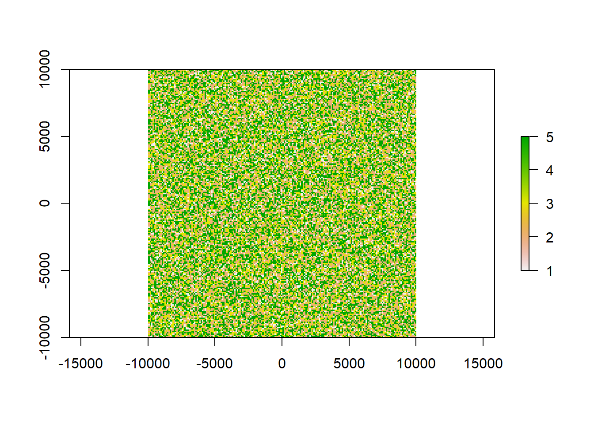

# Calculating class area from raster


## Simple area and area fraction calculations on a classified raster

For this tutorial you will need to load the following packages:


```r
library(raster)
library(sf)
library(tidyverse)
```

You will often come across the task of extracting the area each of your raster classes occupies within your entire raster area. There is a simple way of doing this using `raster` and `dplyr`. The output will be a comprehensive table. First let's create some dummy data to work with:

### Creating dummy data


```r
x <- raster(ncol=100, nrow=100, xmn=-10000, xmx=10000, ymn=-10000, ymx=10000)

res(x)<-100 # we are using a resolution of 100 x 100 so that each pixel is 1ha in size

#populate the raster with values

values(x)<-base::sample(5, ncell(x), replace = T, prob = c(10,30,20,5,35))


plot(x)
```



Our raster now contains 5 classes that could e.g. be land-use types such as forest, infrastructure or pasture. We additionally gave each class a probability of occurrence so that we can double check of our calculated areas are correct. In total, our raster `x` has 4\times 10^{4} cells.

### Preparing the raster for area calculation

To get area metrics, we need to transform the raster into a data frame:


```r
rast_df<-x%>%as.data.frame(xy = T, na.rm = T)
```

To count each pixel, we can assign an extra column to this dataframe with an `ID` `1` to be able to tally all cells. Additionally, we are extracting the resolution of our raster as a variable to our environment to later calculate the area.


```r
rast_df$ID<-1

reso<-res(x)[1]

head(rast_df)
```

```
##       x    y layer ID
## 1 -9950 9950     5  1
## 2 -9850 9950     2  1
## 3 -9750 9950     5  1
## 4 -9650 9950     5  1
## 5 -9550 9950     4  1
## 6 -9450 9950     3  1
```

The `layer` column contains the class each pixel was assigned to. This will be universal for any raster you put in. `ID` is the same for each row, this is only needed in the next step.

### Compiling a comprehensive table


```r
area<-rast_df%>%group_by(layer)%>%
  summarise(pixelsum = sum(ID), area_ha = (pixelsum*reso^2)/10000)%>%
  mutate(sumA = sum(pixelsum), per = 100*pixelsum/sumA)%>%
  rename(class = layer)
```

```
## `summarise()` ungrouping output (override with `.groups` argument)
```

```r
area
```

```
## # A tibble: 5 x 5
##   class pixelsum area_ha  sumA   per
##   <int>    <dbl>   <dbl> <dbl> <dbl>
## 1     1     4062    4062 40000 10.2 
## 2     2    12017   12017 40000 30.0 
## 3     3     7998    7998 40000 20.0 
## 4     4     2046    2046 40000  5.12
## 5     5    13877   13877 40000 34.7
```

And there we go. Each class has it's `pixelsum` calculated, then using the sum we can calculate the area in ha (or else, here you can alternate the code). In this case the pixel sum matches our `area_ha` because one pixel is already of size 1 ha. We can change the code to e.g. calculate `area_km2`.


```r
area_km2<-rast_df%>%group_by(layer)%>%
  summarise(pixelsum = sum(ID), area_km2 = pixelsum/100)%>%
  mutate(sumA = sum(pixelsum), per = 100*pixelsum/sumA)%>%
  rename(class = layer)
```

```
## `summarise()` ungrouping output (override with `.groups` argument)
```

```r
area_km2
```

```
## # A tibble: 5 x 5
##   class pixelsum area_km2  sumA   per
##   <int>    <dbl>    <dbl> <dbl> <dbl>
## 1     1     4062     40.6 40000 10.2 
## 2     2    12017    120.  40000 30.0 
## 3     3     7998     80.0 40000 20.0 
## 4     4     2046     20.5 40000  5.12
## 5     5    13877    139.  40000 34.7
```

Next we calculate the sum of all pixels (`sumA`) using `mutate()` to get the total raster area. This should in this case be the same as `ncell(x)` (40000). To derive the percentage of the entire each class occupies, we just need to divide the `pixelsum` of each class by the total sum and multiply by 100. This should match our probabilities we assigned for each class when filling the raster with values:


```r
area_km2$per == summary(as.factor(values(x)))/400
```

```
##    1    2    3    4    5 
## TRUE TRUE TRUE TRUE TRUE
```

Enjoy trying it out on your own raster with some actual class ares!
