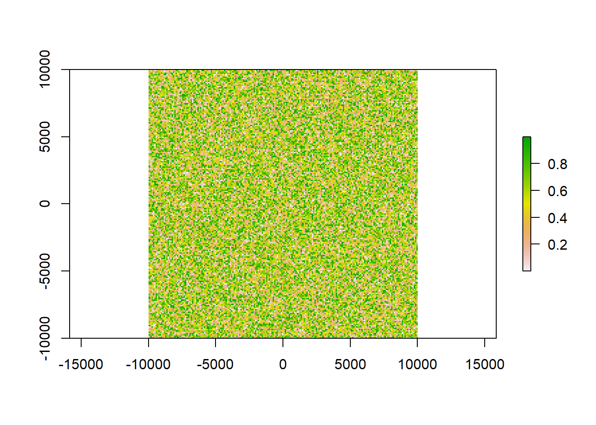
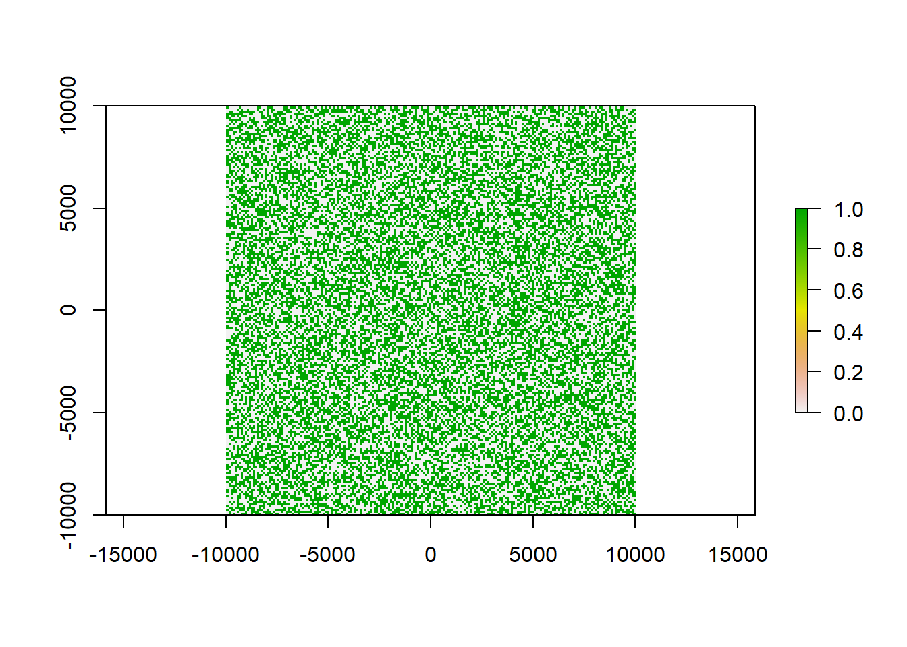
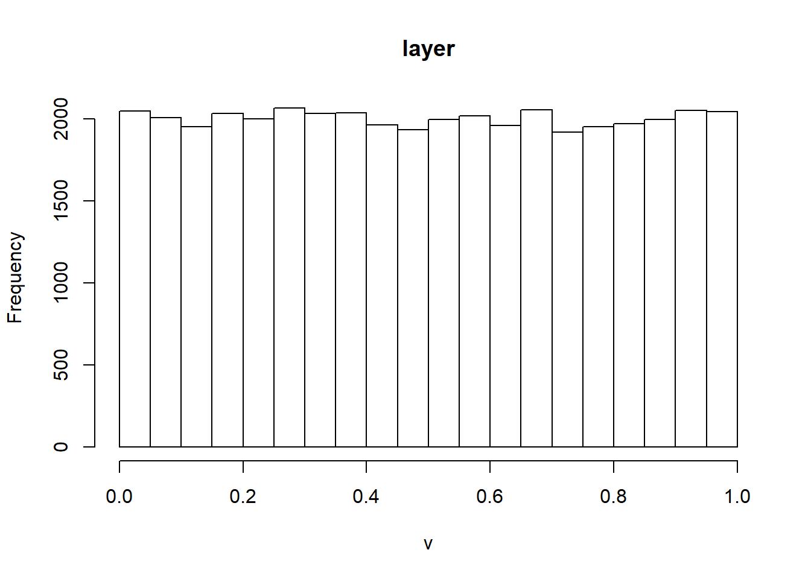
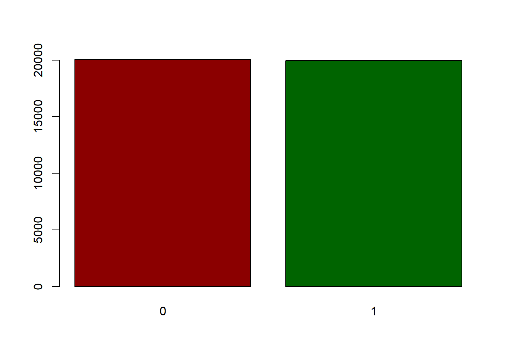
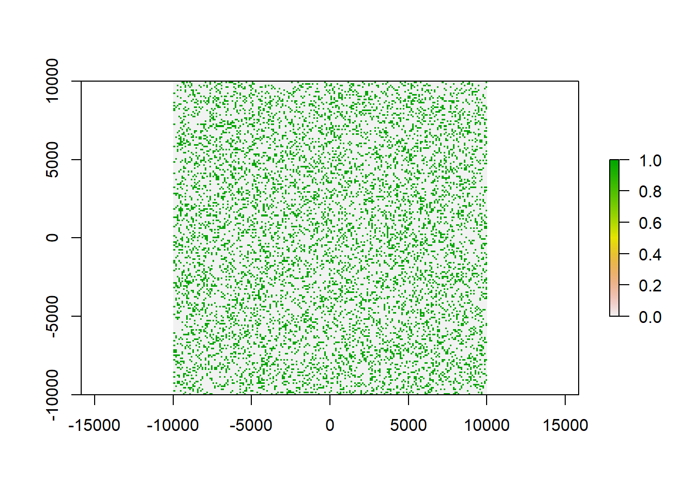
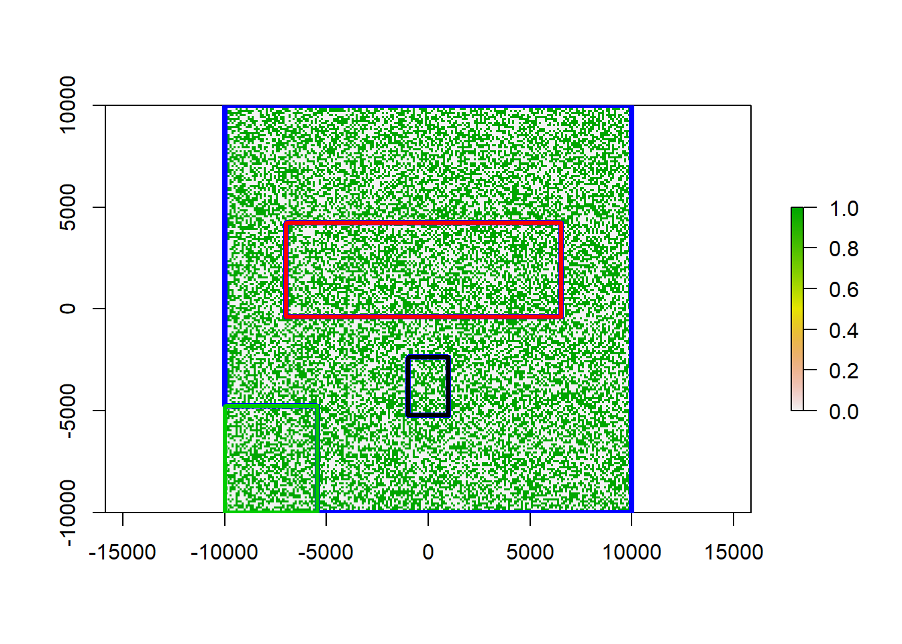
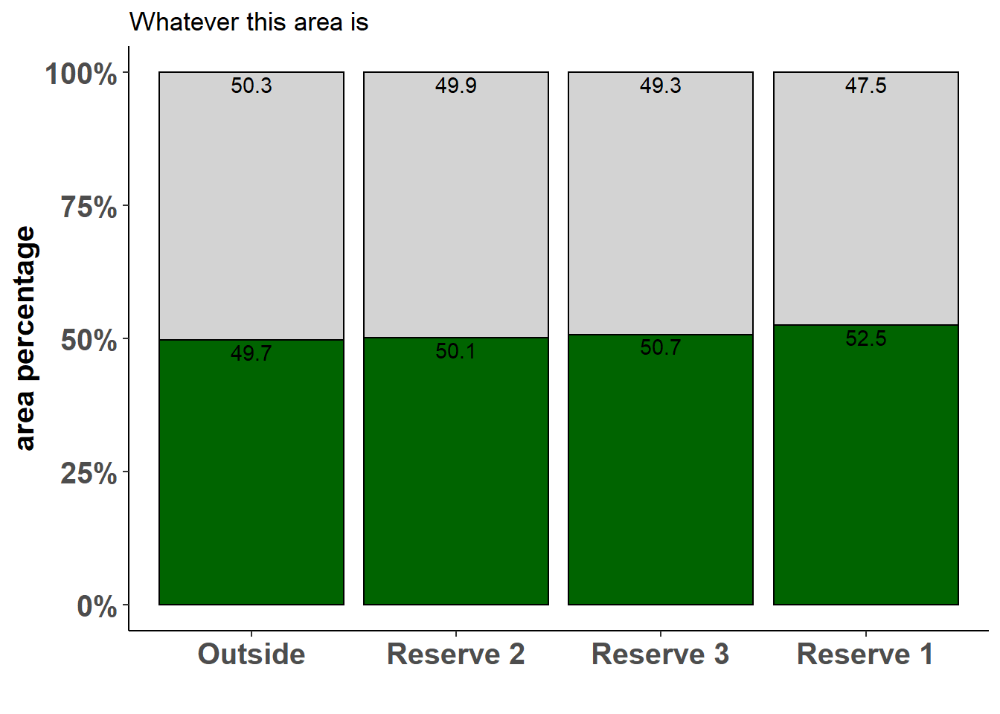

# Extracting raster fractions and area using a polygon mask


## Problem statement

For this tutorial you will need to load the following packages. Please install if you don't have them yet.


```r
library(raster)
library(sf)
library(exactextractr)
library(tidyverse)
```

Say you have a raster of habitat suitability for a certain species. You could now be interested, how much suitable habitat lies within certain defined areas. For example we could check weather the species is adequately protected by extracting how much suitable area lies within National Parks or other reserves Additionally we can test, how much suitable (and unsuitable) area lies outside the areas you want to test to have an idea of the potential for further protection, or the danger to the species from e.g. land clearing outside of parks. In the end we additionally want to know which fraction of the total area both suitable and unsuitable habitat occupies with our parks, reserves and outside ares.

## Creating some dummy raster data

First let's get a raster to play around with:


```r
x <- raster(ncol=100, nrow=100, xmn=-10000, xmx=10000, ymn=-10000, ymx=10000)

res(x)<-100 #make the resolution 100 x 100 meter, so one cell is 1 ha in size

values(x)<-runif(ncell(x)) #populate the raster with random values between 0 - 1

plot(x)
```



This raster now contains makeshift values of habitat suitability on a percentage scale. Let's say we found our cutoff point for suitable habitat at `0.5`. Any values below this cutoff are then defined as unsuitable for our target species. We can reclassify our raster accordingly:


```r
x_re<-reclassify(x, c(-Inf,0.5,0,
                 0.5,Inf,1))

plot(x_re)
```



`0` now means non suitable and `1` suitable habitat. Since we randomized our values using `runif()` we have a equal distribution, meaning that 50% of the area is suitable and 50% of the area is unsuitable. This will help us in double-checking our results later but will probably never occur in real life examples.


```r
hist(x)
```



```r
barplot(x_re, col = c('darkred','darkgreen'))
```



If we wanted to get different probabilities, we could also create our classified raster like this:


```r
x_re2 <- raster(ncol=100, nrow=100, xmn=-10000, xmx=10000, ymn=-10000, ymx=10000)

res(x_re2)<-100

values(x_re2)<-sample(0:1, ncell(x_re), replace = T, prob = c(80,20))

plot(x_re2)
```



Using `sample()` with `prob = c(80,20)`, assigns 80% of the area as unsuitable, but still on a normal pattern.

## Create some reserves

We also needs some reserve areas to extract values from. 


```r
extent(x_re) #have a look at the extent of our raster to decide for extent of dummy areas
```

```
## class      : Extent 
## xmin       : -10000 
## xmax       : 10000 
## ymin       : -10000 
## ymax       : 10000
```

```r
#create some extents
a<-extent(c(-1000, 1000, -5233, -2355))
b<-extent(c(-7000, 6530, -400, 4223))
c<-extent(c(-10000, -5427, -10000, -4785))

#transform them into polygons
a_sf<-as(a, 'SpatialPolygons')%>%st_as_sf()%>%mutate(name = 'res1')  
b_sf<-as(b, 'SpatialPolygons')%>%st_as_sf()%>%mutate(name = 'res2')    
c_sf<-as(c, 'SpatialPolygons')%>%st_as_sf()%>%mutate(name = 'res3')  

#get the total area to create our outside areas 
all<-as(extent(x_re), 'SpatialPolygons')%>%st_as_sf()%>%mutate(name = 'outside')  

plot(x_re)
plot(a_sf$geometry, add = T, lwd = 2, border = 'red')
plot(b_sf$geometry, add = T, lwd = 2, border = 'blue')
plot(c_sf$geometry, add = T, lwd = 2, border = 'orange')
```


Now we have three areas that we assume to be our reserves. We still need a polygon for all other areas, also we need to combine our polygons into one.


```r
#bind reserves

reserves<-rbind(a_sf, b_sf, c_sf)

#get the outside areas only

outside<-st_difference(all, st_combine(reserves))

#bind all for extraction

all_areas<-rbind(reserves, outside)

plot(x_re)
plot(st_geometry(outside$geometry), border = 'blue', lwd = 4, add = T)
plot(st_geometry(reserves), 
     border = as.factor(reserves$name), lwd = 3, add =T)
```



The blue area is all raster area outside of our reserves. Our three reserves are colored in red, black and green. 

## Extracting data

To extract the cell data from each polygon, we use `exact_extract` from the package `exactextractr`, which is a quicker alternative to `raster::extract`. It extracts data from each feature separately in parallel and saves the extracted values into a list.


```r
extract<-exact_extract(x_re,all_areas, fun = NULL)
```

```
## 
  |                                                                       
  |                                                                 |   0%
  |                                                                       
  |================                                                 |  25%
  |                                                                       
  |================================                                 |  50%
  |                                                                       
  |=================================================                |  75%
  |                                                                       
  |=================================================================| 100%
```

```r
for( i in seq_along(extract)){
  
  extract[[i]]$ID <- seq_along(extract)[i]
}
```

In the second step, we assign an ID column to each table in the created list. This will help us in matching the extracted values to the name of the area polygon we extracted from. We convert out list into a table and then add the `lc` column to assign each value the name of the polygon it belongs to:


```r
extract_table<-dplyr::bind_rows(extract)%>%dplyr::select(-2)

extract_table$lc <- as.factor(all_areas$name[extract_table$ID])

head(extract_table)
```

```
##   value ID   lc
## 1     1  1 res1
## 2     0  1 res1
## 3     0  1 res1
## 4     0  1 res1
## 5     0  1 res1
## 6     0  1 res1
```

We can now compile a summary table using `dplyr` syntax. To calculate the area, we are working with the resolution of the raster and will need to save it as a variable fist.


```r
reso<-res(x_re)[1]

area_habitat<-extract_table%>%group_by(lc, value)%>%
  summarise(pixelsum = sum(ID), areaha = (pixelsum*reso^2)/10000)%>%
  mutate(sumA = sum(pixelsum), per = 100*pixelsum/sumA)%>%ungroup()%>%
  mutate(sum_all = sum(pixelsum), pertotal = 100*pixelsum/sum_all)

area_habitat
```

```
## # A tibble: 8 x 8
##   lc      value pixelsum areaha   sumA   per sum_all pertotal
##   <fct>   <dbl>    <int>  <dbl>  <int> <dbl>   <int>    <dbl>
## 1 outside     0    61276  61276 123560  49.6  144258   42.5  
## 2 outside     1    62284  62284 123560  50.4  144258   43.2  
## 3 res1        0      299    299    600  49.8  144258    0.207
## 4 res1        1      301    301    600  50.2  144258    0.209
## 5 res2        0     6342   6342  12784  49.6  144258    4.40 
## 6 res2        1     6442   6442  12784  50.4  144258    4.47 
## 7 res3        0     3690   3690   7314  50.5  144258    2.56 
## 8 res3        1     3624   3624   7314  49.5  144258    2.51
```
What happens here is, we group by class (`lc` which refers to our polygon names) as well as value (0 for unsuitable and 1 for suitable habitat). We then tally all pixels using the `ID` column and calculate the area in ha from the `pixelsum`. In our case these match because the resolution is already 1 ha (each cell is 100x100 meters). Furthermore we can then tally all pixels to get the total raster area and from that calculate first the percentage of suitable and unsuitable habitat in each polygon and then (by using `ungroup()`) the fraction of this area compared to the total raster area.

## Plotting the results

Using `ggplot2` we can then plot these results to better visualize them. The code below will work for any table that is in the format of our `area_habitat` table above, if you follow the steps of this guide.


```r
bar<-ggplot(data = area_habitat, aes(x = reorder(as.factor(lc), -pixelsum), y = per, fill = as.factor(value)))+
  geom_bar(stat = 'identity', color = 'black', position=position_fill(), show.legend = FALSE)+
  scale_y_continuous(labels = scales::percent)+
  geom_text(aes(label=round(per, digits = 1)), check_overlap = TRUE, position=position_fill(),
            vjust = 1.2, color = 'black')+
  theme_classic()+
  theme(axis.title.y = element_text(size = 15, face = 'bold'),
        axis.title.x = element_text(size = 15, face = 'bold'),
        axis.text.x = element_text(size = 15, face = 'bold'), 
        axis.text.y = element_text(size = 15, face = 'bold'))+
  ggtitle('Whatever this area is')+
  xlab('')+
  ylab('area percentage')+
  scale_x_discrete(labels=c('Outside', 'Reserve 2', 'Reserve 3', 'Reserve 1'))+
  scale_fill_manual(values = c('lightgrey', 'darkgreen'), labels = c('unsuitable', 'suitable'), name = '')

bar
```



Our plot shows for each area we wanted to test, which fraction is suitable and which unsuitable. As expected, in our example we have about a 50:50 distribution, but this may look quite different in a real-world example.

Hope you can find a useful application for this code! :)
