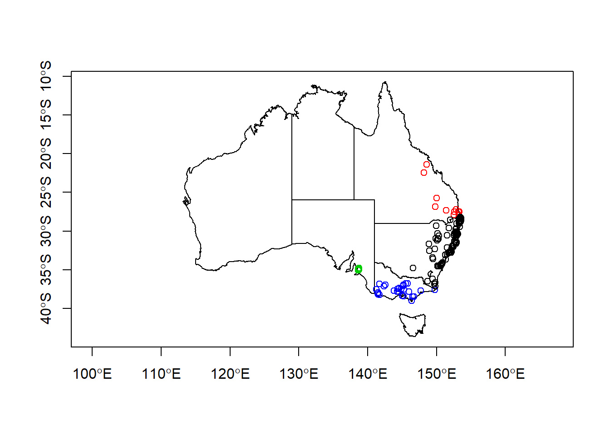
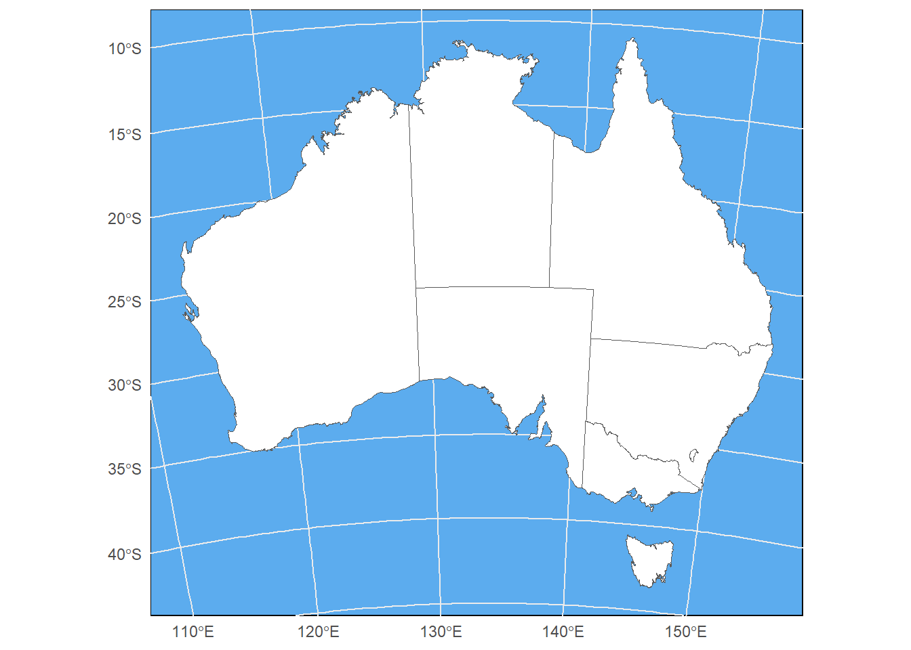
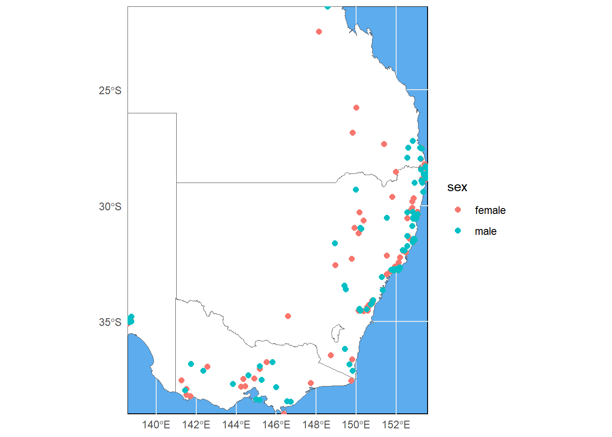
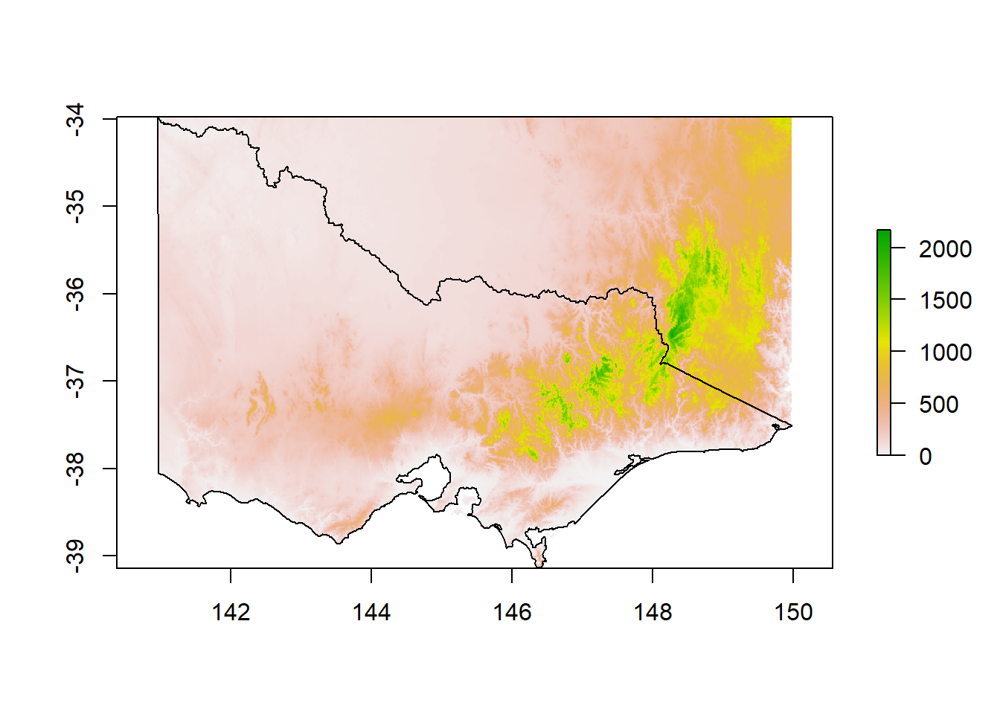
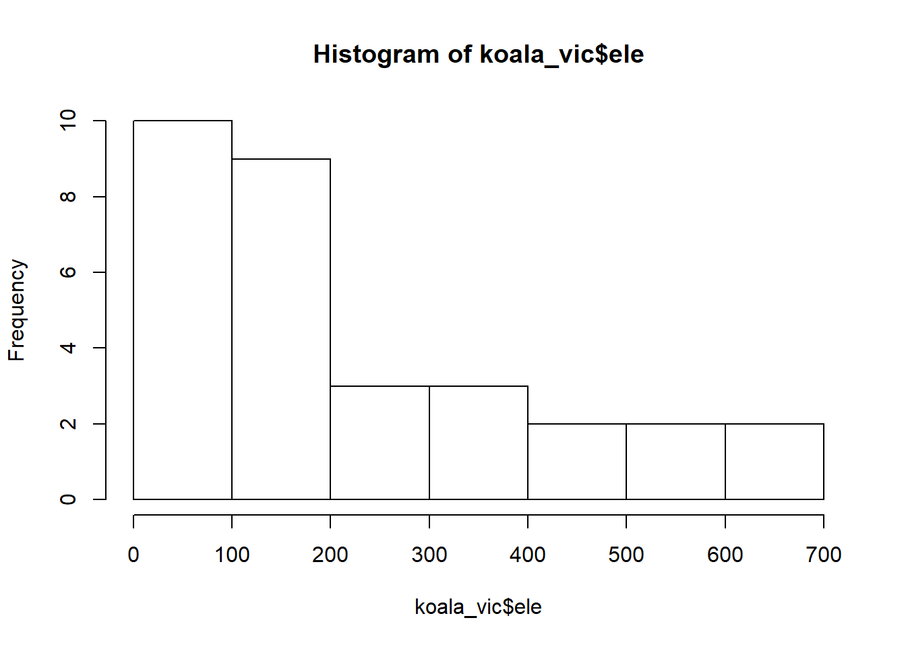
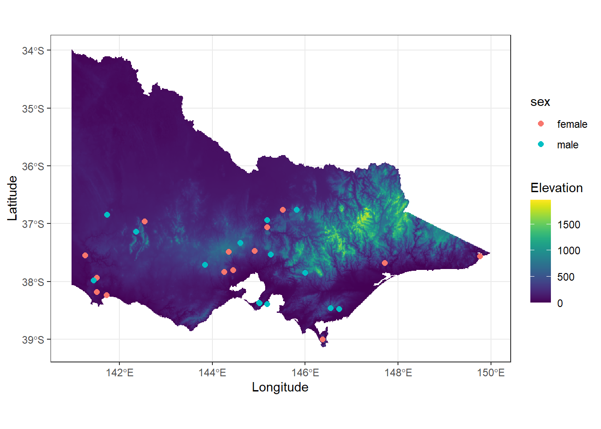

# Working with spatial data in `R`


Many of you will be familiar with using spatial data such as vector data in form of shapefiles or raster data in GIS software, which can handle these files intuitively. Nevertheless, GIS do have some disadvantages when it comes to either large data sets or automation processes. `R` offers a full integration of spatial tools and references such as **GDAL** or **PROJ** and some great packages to deal with this data seamlessly. Today we are going to learn how to use the package `sf` and have a brief detour towards raster data in `R`. You are going to need to install the following packages for this tutorial:


```r
install.packages(c('tidyverse', 'sf', 'raster', 'viridis'))
```

And then call the packages:


```r
library(sf)
library(raster)
library(viridis)
library(tidyverse)
```

We will be working on a dataset of koala observations, that you can download [here](https://www.dropbox.com/s/1zhru8ui3btmg0n/koala.csv?dl=1), as well as a basic administrative Areas shapefile of Australia, which you can find [here](https://www.dropbox.com/s/7edsxu5eezrzrqu/Australia.rar?dl=1). For the last part we will be looking at rasters, with a digital elevation model (DEM) file as example. You can find it for download [here](https://www.dropbox.com/s/u2j6a73t7nv0lww/DEM.tif?dl=0). Please make sure these are stored within a `data/` folder in an `R` project (or working directory).

## Transforming a dataset into an `sf` object

Let's first load in our dataset and have a look at it's structure


```r
koala <- read.csv('data/koala.csv')

head(koala) # see the first few rows in the console
```

```
##                  species        X         Y      state   region    sex   weight
## 1 Phascolarctos cinereus 153.2155 -27.49284 Queensland northern   male 7.119754
## 2 Phascolarctos cinereus 148.1443 -22.47617 Queensland northern female 5.451345
## 3 Phascolarctos cinereus 153.2285 -27.50298 Queensland northern   male 6.630577
## 4 Phascolarctos cinereus 152.6000 -27.50000 Queensland northern   male 6.470019
## 5 Phascolarctos cinereus 153.2817 -27.52589 Queensland northern female 5.620447
## 6 Phascolarctos cinereus 152.8330 -27.20000 Queensland northern   male 7.287674
##       size      fur     tail age      color joey        behav           obs
## 1 70.80159 1.858696 1.168241   8       grey   No     Sleeping  Spotlighting
## 2 70.38537 1.852801 1.562456  10 grey-brown  Yes     Sleeping Opportunistic
## 3 68.65867 2.479280 1.056640   1 light grey   No Just Chillin  Spotlighting
## 4 72.98919 1.923974 1.801244   1       grey   No     Sleeping  Stagwatching
## 5 65.19529 1.945341 1.625600  10 grey-brown   No     Sleeping  Stagwatching
## 6 70.56514 1.688897 1.086675  12 grey-brown   No      Feeding Opportunistic
```

As we can see it contains lots of variables related to each of the observed koalas, such as `sex`, `weight` or in which `state` the observation was made. Additionally, whoever collected this data was so kind to also include the `X` and `Y` coordinates, where the observation was made. This we can use to transform this into an `sf` (simple feature) object.


```r
koala_sf <- st_as_sf(koala, 
                     coords = c("X", 
                                "Y"), 
                     crs = 4326)
str(koala_sf)
```

```
## Classes 'sf' and 'data.frame':	242 obs. of  14 variables:
##  $ species : Factor w/ 1 level "Phascolarctos cinereus": 1 1 1 1 1 1 1 1 1 1 ...
##  $ state   : Factor w/ 4 levels "New South Wales",..: 2 2 2 2 2 2 2 2 2 2 ...
##  $ region  : Factor w/ 2 levels "northern","southern": 1 1 1 1 1 1 1 1 1 1 ...
##  $ sex     : Factor w/ 2 levels "female","male": 2 1 2 2 1 2 2 2 1 1 ...
##  $ weight  : num  7.12 5.45 6.63 6.47 5.62 ...
##  $ size    : num  70.8 70.4 68.7 73 65.2 ...
##  $ fur     : num  1.86 1.85 2.48 1.92 1.95 ...
##  $ tail    : num  1.17 1.56 1.06 1.8 1.63 ...
##  $ age     : int  8 10 1 1 10 12 9 1 1 1 ...
##  $ color   : Factor w/ 6 levels "chocolate brown",..: 3 4 6 3 4 4 6 4 3 3 ...
##  $ joey    : Factor w/ 2 levels "No","Yes": 1 2 1 1 1 1 1 1 1 1 ...
##  $ behav   : Factor w/ 3 levels "Feeding","Just Chillin",..: 3 3 2 3 3 1 2 3 1 3 ...
##  $ obs     : Factor w/ 3 levels "Opportunistic",..: 2 1 2 3 3 1 3 2 2 2 ...
##  $ geometry:sfc_POINT of length 242; first list element:  'XY' num  153.2 -27.5
##  - attr(*, "sf_column")= chr "geometry"
##  - attr(*, "agr")= Factor w/ 3 levels "constant","aggregate",..: NA NA NA NA NA NA NA NA NA NA ...
##   ..- attr(*, "names")= chr  "species" "state" "region" "sex" ...
```

The `sf` object is a `data.frame` with a *geometry list-column*. It supports different format and spatial references. The file as it exists in your `R` environment is what you would call the *Attribute table* in a GIS software. In `R` you can use and manipulate it as any other `data.frame`. When converting a table into a `sf` we need to indicate the columns containing coordinates using `coords = c()` and we can decide on a coordinate reference system using `crs=`. Here we decide to use WGS84 (CRS = 4326), a standard Mercator coordinate frame for the Earth given in Latitude and Longitude. We can plot our now spatial data with the standard base R command:


```r
plot(koala_sf)
```

```
## Warning: plotting the first 10 out of 13 attributes; use max.plot = 13 to plot
## all
```


This will try to plot all columns (because they are now all spatially referenced). To only plot the geometries, you can:


```r
plot(koala_sf$geometry)
```


So far so good, but we will need a bit more data to make a nice map!

## Loading shapefiles into `R`, transforming and plotting

You can load any vector file, such as .shp or .gpkg using `st_read`. Let's get our Australia map into the environment and check it out:


```r
states <- st_read("data/Australia/Australia_proj.shp")
```

```
## Reading layer `Australia_proj' from data source `D:\OneDrive\OneDrive - The University of Melbourne\Github\bookdown-playaround\data\Australia\Australia_proj.shp' using driver `ESRI Shapefile'
## Simple feature collection with 8 features and 15 fields
## geometry type:  POLYGON
## dimension:      XY
## bbox:           xmin: -2063975 ymin: -4965263 xmax: 1891143 ymax: -1285856
## projected CRS:  GDA94 / Geoscience Australia Lambert
```

```r
plot(states$geometry)
```


Great, we even have states column, which will we will use a bit later. To plot, simply use base `R` syntax of plotting and then plotting another graph on top using `add = T`. Instead of calling `plot(file$geometry)`, we can also call `st_geometry()`


```r
plot(st_geometry(states), 
     axes = TRUE)

plot(st_geometry(koala_sf), # why does this not work?
     col = "blue", 
     add = T)
```


Hm, our states are plotting fine, but where are our koala locations? Maybe we should check the coordinate reference system to see if they match... Here's how that's done:


```r
st_crs(states)
```

```
## Coordinate Reference System:
##   User input: GDA94 / Geoscience Australia Lambert 
##   wkt:
## PROJCRS["GDA94 / Geoscience Australia Lambert",
##     BASEGEOGCRS["GDA94",
##         DATUM["Geocentric Datum of Australia 1994",
##             ELLIPSOID["GRS 1980",6378137,298.257222101,
##                 LENGTHUNIT["metre",1]]],
##         PRIMEM["Greenwich",0,
##             ANGLEUNIT["degree",0.0174532925199433]],
##         ID["EPSG",4283]],
##     CONVERSION["Geoscience Australia Standard National Scale Lambert Projection",
##         METHOD["Lambert Conic Conformal (2SP)",
##             ID["EPSG",9802]],
##         PARAMETER["Latitude of false origin",0,
##             ANGLEUNIT["degree",0.0174532925199433],
##             ID["EPSG",8821]],
##         PARAMETER["Longitude of false origin",134,
##             ANGLEUNIT["degree",0.0174532925199433],
##             ID["EPSG",8822]],
##         PARAMETER["Latitude of 1st standard parallel",-18,
##             ANGLEUNIT["degree",0.0174532925199433],
##             ID["EPSG",8823]],
##         PARAMETER["Latitude of 2nd standard parallel",-36,
##             ANGLEUNIT["degree",0.0174532925199433],
##             ID["EPSG",8824]],
##         PARAMETER["Easting at false origin",0,
##             LENGTHUNIT["metre",1],
##             ID["EPSG",8826]],
##         PARAMETER["Northing at false origin",0,
##             LENGTHUNIT["metre",1],
##             ID["EPSG",8827]]],
##     CS[Cartesian,2],
##         AXIS["(E)",east,
##             ORDER[1],
##             LENGTHUNIT["metre",1]],
##         AXIS["(N)",north,
##             ORDER[2],
##             LENGTHUNIT["metre",1]],
##     USAGE[
##         SCOPE["unknown"],
##         AREA["Australia - onshore"],
##         BBOX[-43.7,112.85,-9.86,153.69]],
##     ID["EPSG",3112]]
```

```r
st_crs(koala_sf)
```

```
## Coordinate Reference System:
##   User input: EPSG:4326 
##   wkt:
## GEOGCRS["WGS 84",
##     DATUM["World Geodetic System 1984",
##         ELLIPSOID["WGS 84",6378137,298.257223563,
##             LENGTHUNIT["metre",1]]],
##     PRIMEM["Greenwich",0,
##         ANGLEUNIT["degree",0.0174532925199433]],
##     CS[ellipsoidal,2],
##         AXIS["geodetic latitude (Lat)",north,
##             ORDER[1],
##             ANGLEUNIT["degree",0.0174532925199433]],
##         AXIS["geodetic longitude (Lon)",east,
##             ORDER[2],
##             ANGLEUNIT["degree",0.0174532925199433]],
##     USAGE[
##         SCOPE["unknown"],
##         AREA["World"],
##         BBOX[-90,-180,90,180]],
##     ID["EPSG",4326]]
```

Damn, they do not match. Our Australia shapefile has a different (weird) projection. If you feel it's tedious to check the CRS in the console, simply type 


```r
st_crs(states)==st_crs(koala_sf)
```

```
## [1] FALSE
```

`FALSE` is returned, so they don't match. We need to transform one of them to be able to plot our spatial points on top of the Australia map. `sf` has a simple solution for this using `st_transform()`. Let's do that and plot straight away.


```r
koala_proj <- st_transform(koala_sf, crs = st_crs(states))

plot(st_geometry(states), 
     axes = TRUE)

plot(st_geometry(koala_proj), 
     col = "blue", 
     add = T)
```


Excellent! In `st_transform` we can call any `crs` from another spatial file in the environment, our define our own using a `proj4string`. If we look at our plot, we can see that the coordinates on the axis look weird. We'd rather like latitude and longitude to make it look more comprehensive. That's now up to you to fix it!

### Challenge 1

**Load the Australia_proj and koala data again and plot them on top of each other in Mercator projection (CRS: 4326). Note: check the spatial reference of the maps first!**

*Extra challenge: color the koala points based on state! Check `?sf::plot` for tips*




Looks good! You can find the solutions to all challenges posed here at the end of the document. Don't peek!

Let's make our maps look even better.

## Simple geometric operations

`sf` supports any geometric operations you know from GIS software. We will just touch cropping here, but you can also merge, intersect, overlap and many more. For the purpose of mapping, `st_crop()` is most relevant. Let's say we want to create a map of all our Koala locations, we won't necessarily need to show all of Australia, knowing that Koalas are only distributed along the east coast. Let's crop the Australia shapefile by the extent of our observations:


```r
australia_koala_area<-st_crop(states_proj, koala_sf)
```

```
## although coordinates are longitude/latitude, st_intersection assumes that they are planar
```

```
## Warning: attribute variables are assumed to be spatially constant throughout all
## geometries
```

```r
plot(st_geometry(australia_koala_area), axes = T)

plot(st_geometry(koala_sf), add = T)
```


Great. Let's say we want to save the new cropped shapefile to an `outputs/` folder in our project. For this we simply use `st_write()`:


```r
st_write(australia_koala_area, 'outputs/koala_shape.gpkg')
```

You can choose different file extensions. Here we are saving a geopackage, as it results in only one file, rather than 4-6 for a .shp extension. Up to you ;) Let's make a good looking map with our data!

## Making a map using `ggplot2`

`ggplot2` supports plotting spatial data by calling `geom_sf()`, after defining your data to plot. In simple terms we can create a map of Australia by calling:


```r
ggplot(data = states_proj) + geom_sf()
```


which already looks a lot better than base R. But there are a lot of improvements to be made to create a publication-ready map. First we can assign colors based on columns in your data. We can also remove the standard grey ggplot background with a more map-friendly white grid using `theme_minimal()`


```r
ggplot(data = states_proj)+
  geom_sf(aes(fill = STATENAME))+
  theme_minimal()
```


We don't really need a legend here, let's remove it:


```r
ggplot(data = states_proj)+
  geom_sf(aes(fill = STATENAME))+
  theme_minimal()+
  guides(fill = F)
```


Using `coord_sf()` we can even change the projection while plotting in `ggplot2`, without the need of going back to reprojecting or transforming in `sf`.


```r
ggplot(data = states_proj)+
  geom_sf(aes(fill = STATENAME))+
  theme_minimal()+
  guides(fill = F)+
  coord_sf(crs = 3112)
```


Did you see what changed? Finally we can change the fore- and background color to make it look like proper map in a nice blue ocean:


```r
ggplot(data = states_proj)+
  geom_sf(size = 0.3, fill = 'white')+
  theme_minimal()+
  coord_sf(crs = 3112)+
  theme(panel.background = element_rect(fill = 'steelblue2'))
```



### Challenge 2

**Add the koala positions on top of the Australia map in ggplot2. Only plot the area that has koalas and color the points by sex of the individual. Please also give the map in Mercator projection**

*You will need to:* 

1. Add a second layer to your ggplot
2. Define the crs


Good job! But unfortunately our cut-out looks like an island surrounded by seawater. If we want the map to look like a close-up of eastern Australia, we need to tell `ggplot2` to start plotting at x/y = 0:


```r
ggplot(data = australia_koala_area)+
  geom_sf(size = 0.3, fill = 'white')+
  geom_sf(data = koala_sf, size = 2, aes(color = sex), show.legend = "point")+
  theme_minimal()+
  coord_sf(crs = 4326)+
  theme(panel.background = element_rect(fill = 'steelblue2'))+
  scale_x_continuous(expand = c(0,0))+
  scale_y_continuous(expand = c(0,0))
```



When working with these types of maps, you will often be asked to create an inset map that shows the entire area that you cropped from for reference. Let's add a little Australia shape with a bounding box of our study area to our map. First we need to create the a base map with bounding box and save it to the environment:


```r
inset<-ggplot(data = states_proj, show.legend = "point")+
  geom_sf()+
  geom_rect(xmin = extent(australia_koala_area)[1], xmax = extent(australia_koala_area)[2],
            ymin = extent(australia_koala_area)[3], ymax = extent(australia_koala_area)[4],
            fill = NA,  colour = "black", size = 1.5)+
  labs(x = '', y = '', title = '')+
  coord_sf(crs = 4326)+
  theme_void()

inset
```


`geom_rect` can create any rectangular shape within your ggplot based on `xmin`, `xmax` and so on. Since these are dependent on your scales, for mapping we can use the `extent` of our cropped area from before. `extent()` is part of the `raster` package:


```r
extent(australia_koala_area)
```

```
## class      : Extent 
## xmin       : 138.5795 
## xmax       : 153.5651 
## ymin       : -39 
## ymax       : -21.3906
```

By using `[1]`, `[2]` and so on, we call the respective coordinate from the four rows that this function is giving us. Using `theme_void()` is getting rid of any axis and grids, so that we have the map only. We also need to save our map as an object:


```r
map<-ggplot(data = australia_koala_area)+
  geom_sf(size = 0.3, fill = 'white')+
  geom_sf(data = koala_sf, size = 2, aes(color = sex), show.legend = "point")+
  theme_minimal()+
  coord_sf(crs = 4326)+
  theme(panel.background = element_rect(fill = 'steelblue2'))+  
  scale_x_continuous(expand = c(0,0))+
  scale_y_continuous(expand = c(0,0))
```

We use `annotation_custom()` and `ggplotGrob()` to place an inset into the main map:


```r
map+annotation_custom(ggplotGrob(inset), xmin = 139, xmax = 144, ymin = -26, ymax = -20)
```


The size and position here is defined by `xmin = ` etc. This needs a bit of fiddling around to get it right. Also be mindful that we are using a Mercator projection here and are in the southern hemisphere, so our `ymin` and `ymax` values need to be given in negative form. Now this is a proper map, ready to be put in your next publication! We will briefly talk about rasters, because you are likely to use them if you are working with shapefiles anyway. It is similarly easy to work with rasters in `R`:

## `R` raster basics

Raster support in `R` is made available using the package `raster`. One called, we can load and plot a raster using the same command. Let's get our DEM to play with:


```r
dem<-raster('data/DEM.tif')

summary(dem)
```

```
## Warning in .local(object, ...): summary is an estimate based on a sample of 1e+05 cells (21.51% of all cells)
```

```
##                DEM
## Min.       0.00000
## 1st Qu.   88.84984
## Median   157.13261
## 3rd Qu.  398.30093
## Max.    2139.42236
## NA's       0.00000
```

```r
plot(dem)
```


In a raster, cell (or pixel) has a spatial reference and a value. In this case we have the elevation in meters for each degree (0.01, 0.01) in southeastern Australia.

Let's say we're only interested in Victoria. We can use a spatial vector to  mask out the state area from the raster. First we need to create a mask. We already know that our Australia shapefile contains a `STATE` column. We can use that to subset the shapefile and use the subset as a mask. Simple `dplyr` commands and `%>%` work on `sf` features, which makes working with them so easy in `R`!


```r
vic<-states_proj%>%filter(STATENAME == 'Victoria')%>%st_transform(crs = st_crs(dem)) # we also transform the crs to be sure they match

plot(dem)
plot(vic$geometry, add = T)
```



To remove anything outside of Victoria, we use `raster`'s `mask()` and end up with the DEM for Victoria only:


```r
dem_vic<-mask(dem, vic)

plot(dem_vic)
```


We can now also filter our koala dataset to only have koalas in Victoria to plot over our DEM.


```r
koala_vic<-koala_sf%>%filter(state == 'Victoria')%>%st_transform(crs = st_crs(dem))

plot(dem_vic)

plot(koala_vic$geometry, color = 'black', add = T)
```


Often we are using rasters and spatial vector data together to extract data that is generally stored in raster form (such as elevation, mean temperatures or other topographic variables). For example if we are interested to see at which elevation our Koalas were observed in Victoria to make assumptions about their habitat preferences or temperature tolerances. If the CRS of both the raster and shapefile match, we can use `extract()` to add data from the raster to our spatial points as a new column:


```r
koala_vic$ele<-raster::extract(dem_vic, koala_vic)

summary(koala_vic$ele)
```

```
##    Min. 1st Qu.  Median    Mean 3rd Qu.    Max. 
##   16.62   67.95  185.34  218.54  349.87  648.06
```

```r
hist(koala_vic$ele)
```



We can see most observations were made below 200 meters. The median elevation for koalas in our dataset was 185. Again if we want to make nice and informative maps out of rasters, even in combination with spatial vector data, `ggplot2` is the way to go!

## Plotting rasters in `ggplot2`

Before we can plot a raster, we have to make it into a `data.frame` containing of columns `X` and `Y` as coordinates and a column containing the raster value of each pixel. Since rasters can be large and the resulting dataframes even larger, we first take a sample of the raster, which reduces the resolution:


```r
sample_raster<-sampleRegular(dem_vic, size = 5e5, asRaster = TRUE) %>%
  as.data.frame(xy = TRUE, na.rm = TRUE)%>%
  setNames(c('x', 'y', 'layer'))
```

Make sure to always use `xy = TRUE`, so that the coordinates are included in the new `data.frame`. We now have a format that ggplot can work with using `geom_raster()` 


```
##             x        y    layer
## 902  140.9675 -33.9925 19.73859
## 1803 140.9675 -34.0025 48.89558
## 1804 140.9775 -34.0025 25.70812
## 2704 140.9675 -34.0125 53.28782
## 2705 140.9775 -34.0125 27.96507
## 2706 140.9875 -34.0125 20.13142
```


```r
ggplot(data = sample_raster, aes ( x = x, y = y, fill = layer))+
  geom_raster()
```


Let's make it look a bit prettier. The package `viridis` offers a few great color palettes for gradients of continuous variables:


```r
ggplot(data = sample_raster, aes ( x = x, y = y, fill = layer))+
  geom_raster()+
  scale_fill_viridis(option = 'A')+
  labs(x = 'Longitude', y = 'Latitude', fill = 'Elevation')+
  coord_sf(crs = 4326)+
  theme_bw()
```


We can plot additional layers on top of the raster by adding more `geom_`'s. That means we can plot rasters and spatial vectors together to make great maps for your papers and reports. I'm sure you can figure it out yourself for the next and final challenge!

### Challenge 3

**Add koala observations, color points by a categorical variable of your choice and change the color scheme.**

*hint: to add different types of data, each data layer needs its own data source!:*
*(geom_raster(data = sample_raster, aes(x = x, y = y, fill = layer))+...*)


```r
ggplot()+
  geom_raster(data = sample_raster, aes(x = x, y = y, fill = layer))+
  geom_sf(data=koala_vic, size = 2, aes(color = sex), show.legend = "point")+
  scale_fill_viridis(option = "D") +
  labs(x = "Longitude", 
       y = "Latitude", 
       fill = "Elevation") +
  coord_sf(crs = 4326) +
  theme_bw()
```



## Solutions to Challenges

### Challenge 1


```r
states_proj <- st_transform(states, crs = st_crs(koala_sf))

plot(st_geometry(states_proj), 
     axes = TRUE)

plot(st_geometry(koala_sf), 
     col = koala_sf$state, 
     add = T)
```

### Challenge 2


```r
ggplot(data = australia_koala_area)+
  geom_sf(size = 0.3, fill = 'white')+
  geom_sf(data = koala_sf, size = 2, aes(color = sex))+
  theme_minimal()+
  coord_sf(crs = 4326)+
  theme(panel.background = element_rect(fill = 'steelblue2'))
```

### Challenge 3


```r
ggplot()+
  geom_raster(data = sample_raster, aes(x = x, y = y, fill = layer))+
  geom_sf(data=koala_vic, size = 2, aes(color = sex), show.legend = "point")+
  scale_fill_viridis(option = "D") +
  labs(x = "Longitude", 
       y = "Latitude", 
       fill = "Elevation") +
  coord_sf(crs = 4326) +
  theme_bw()
```
